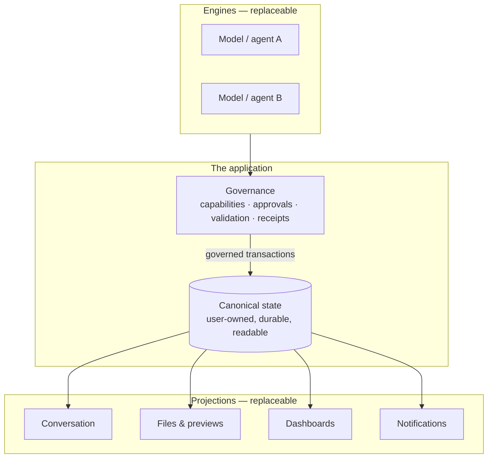
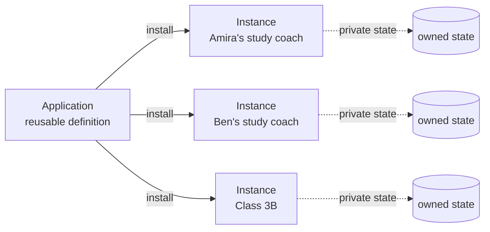
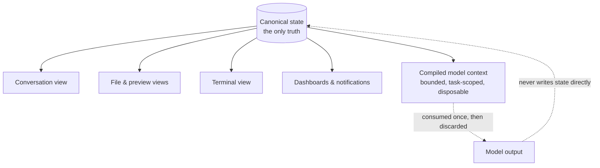
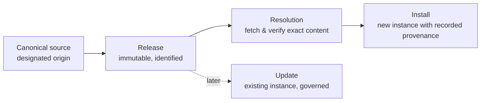
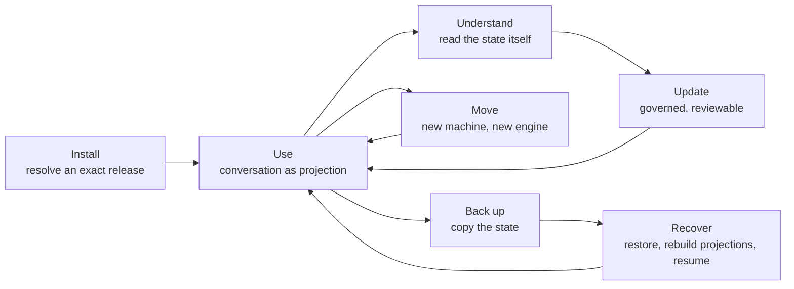
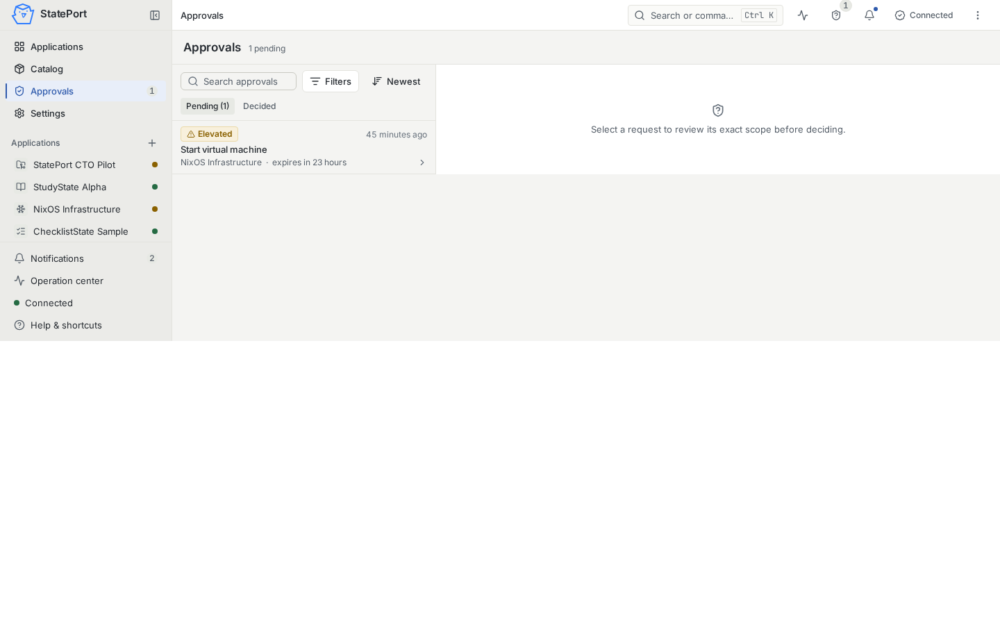
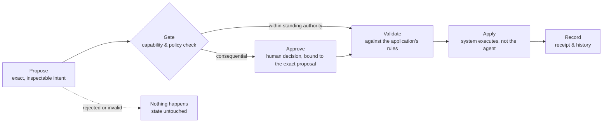

# 1. Abstract and thesis

## Abstract

Today's AI assistants live in chat windows. The conversation is the product,
the vendor's session is the memory, and the transcript is the only record that
anything happened. This arrangement is convenient for a demonstration and
inadequate for everything after it. Memory is hostage to the provider.
Behavior cannot be installed, versioned, or moved. What the assistant did —
and what it was allowed to do — cannot be reconstructed after the fact.

This whitepaper presents **Stateware**: a model in which an AI assistant is
not a chat session but an **application**, and an application is defined by
its **state**. Three claims organize the model. First, an AI application is a
durable, user-owned state object: readable, inspectable, and independent of
any model, vendor, or interface. Second, everything the user sees — the
conversation, the previews, the dashboards — is a projection of that state,
never the truth itself. Third, every mutation of that state is a governed
transaction: proposed, approved where required, validated, applied, and
recorded, with a receipt that can be inspected later.

The model is presented here on its own terms, as a thesis about where the
application boundary should sit in AI software. It is illustrated by
StatePort, a working local reference implementation built on these
principles; the screenshots in this paper show it. The paper makes no
comparative claims. It argues a single idea: **state is the application
boundary** — and that moving the boundary there changes what an assistant can
be.

**Status of the reference implementation.** Representative workflows —
installation, governed conversation, approvals, receipts, updates — have been
exercised against StatePort's real local service. It is not presented as a
hosted service, a production-qualified product, or a completed third-party
application ecosystem.

## Scope and standing of this paper

This is a paper about an idea, written to be read on the idea's merits. It
presents a model and its abstractions, illustrated by a working reference
implementation; it is not an engineering specification, and a reader will
finish it understanding the model fully without being able to reconstruct any
particular system from it. It makes no benchmark claims and asserts no
superiority over other approaches: the question it asks is not "is this
better?" but "is this the right boundary?" Whether the answer is yes is left,
deliberately, to the reader's own experience of the failures described in
Section 2.

## The thesis

A chat window is a reasonable place to *talk to* a model. It is a poor place
to *keep* one.

When the conversation is the application, the application inherits the
properties of a conversation: it fades, it truncates, it belongs to whoever
hosts it, and it cannot be handed to someone else in any meaningful sense.
The assistant a person has shaped over months — its knowledge of their
projects, its instructions, its permissions, its history of decisions — has
no existence independent of the session that contains it. Close the wrong
tab, change the wrong subscription, and the assistant is gone, or stranded.

The thesis of this paper is that the remedy is not a better chat window,
more memory bolted onto one, or a more powerful model behind one. The remedy
is to relocate the application boundary: to decide that the application is
the durable state, and that everything else — the model, the chat interface,
the terminal, the automation — is a replaceable instrument acting on that
state under explicit rules.

> **State is the application boundary.**

This is a stronger claim than "assistants need memory." Memory systems ask
how to retrieve relevant fragments of the past. Stateware asks different
questions. Which information is authoritative? Who owns it? What may change
it, and under whose permission? How is a change proposed, checked, applied,
and evidenced? Can the whole assistant — its knowledge, its behavior, its
history — be picked up, moved to another machine or another model, and
resumed without loss? A chat transcript answers none of these. A
well-formed state object answers all of them.

The shift has precedent. Documents predated word processors as files;
spreadsheets became applications when the sheet — not the session — became
the durable artifact. In each case the field matured when the artifact of
work gained an identity independent of the tool used to produce it. AI
assistants are due the same maturation. Stateware is a name for what they
become when they get it: software whose durable identity is canonical state
plus a governed lifecycle, with models and agents as replaceable processors.

# 2. The failure of the chat-centric model

The chat-centric model is not foolish. It emerged for good reasons: natural
language is the most general interface ever built, and a conversation is the
most natural shape for interacting with a system that speaks. The failure is
not that chat exists. The failure is that chat was allowed to become the
*container* of the application — the place where memory, behavior,
permission, and history silently took up residence. Four distinct failures
follow, and they are worth separating, because they are often blurred into a
single vague dissatisfaction.

## 2.1 Memory held hostage

In the chat-centric model, what the assistant knows is coextensive with what
a provider's session retains. The retention policy is the provider's.
Threads are compacted, truncated, archived, rate-limited, or retired with
the product line. Even where a provider offers continuity, the thread is
operational metadata of the hosting service — it is not something the user
possesses in the way they possess a document.

The deeper issue is not loss but *ownership*. A person's working relationship
with an assistant accumulates real value: context about their projects,
their constraints, their preferences, their past decisions. In the
chat-centric model that value is an asset on someone else's balance sheet,
held under someone else's terms, exportable at best as a bulk dump that no
other system can meaningfully resume. The user has a history; they do not
have a thing.

## 2.2 Behavior that cannot be installed

Ordinary software can be installed. It arrives as a defined artifact, with a
version, and it behaves the same way tomorrow as today until deliberately
updated. An assistant's behavior in the chat-centric model has no such
standing. It is an emergent property of a system prompt somewhere, a pile of
accumulated conversation, and a model version that changes underneath it.
Nothing about "how this assistant works" is an artifact that can be
published, installed by a colleague, pinned by a careful organization, or
rolled back after a bad change.

This is why teams cannot share assistants the way they share software. They
can share prompt text — but a prompt is not an application, any more than a
recipe is a restaurant. The instructions, the knowledge they operate on, the
permissions they assume, and the record of what happened under them travel
separately or not at all.

## 2.3 No verifiable record of action

Ask a chat-centric assistant what it did yesterday and you get a story. The
story may be accurate; it is not evidence. The transcript records what was
*said*, interleaved with what was *done*, in a format designed for reading,
not for audit. There is no structural separation between a proposal and an
execution, no durable binding between an approval and the exact action it
approved, and no artifact one could hand to a skeptical third party — a
manager, a teacher, an auditor, one's future self — that answers: what
changed, who authorized it, and did it succeed?

As assistants move from answering questions to acting in the world — editing
files, sending messages, provisioning infrastructure — this gap stops being
philosophical. An actor that cannot produce a record of its actions is an
actor that cannot be trusted with consequential ones.

## 2.4 No portability

The chat-centric assistant is welded to its host. Its memory is the
provider's thread format, its tools are the provider's integrations, its
continuity is the provider's session machinery. Moving it to a different
model, a different vendor, a different machine, or a self-hosted environment
means starting over — or, at best, performing a one-way export whose
receiving end cannot reconstitute the working relationship.

Portability is usually framed as a hedge against vendors. It is better
framed as a property of maturity. A thing that cannot move cannot be backed
up in any serious sense, cannot be recovered after failure, cannot be
upgraded on the user's schedule, and cannot outlive any particular
implementation. Software that cannot move is not yet fully software.

## 2.5 The common root

These four failures share a root cause. In each case, something that should
be **durable application state** — memory, behavior, record, identity — has
been left inside an **ephemeral presentation**: the session, the transcript,
the provider's runtime. The chat-centric model is not wrong about the
interface; it is wrong about the boundary. It puts the application inside
the conversation, when the conversation should be one replaceable view of
the application.

Reversing that single decision is the whole of the Stateware model.

# 3. The Stateware model

Stateware rests on three claims. Each is simple. Together they redraw the
application boundary.

## 3.1 An AI application is a durable, user-owned state object

The first claim is about what the application *is*. A Stateware application
is a state object: a structured, durable, human-readable body of information
that the user owns outright. It holds the assistant's knowledge and working
notes, its goals and decisions, its configuration and instructions, its
permissions, and the record of what it has done. It lives where the user can
see it, copy it, back it up, and take it elsewhere. It is legible to the
owner, not just to the machine.

Two properties of this claim deserve emphasis. *Durable*: the state does not
depend on any session, process, or provider continuing to exist; losing
every running program loses convenience, not the application. *User-owned*:
the state is not a cache of a service; there is no upstream copy that is
more real than the one the user holds. Ownership here is practical, not
rhetorical — the test is whether the user can walk away with the whole
application and resume it without the original operator's cooperation.

## 3.2 Everything the user sees is a projection of that state

The second claim is about the relationship between the state and the
interface. The conversation view, the file previews, the dashboards, the
notifications, the rendered documents — all of these are **projections**:
views derived from the canonical state, refreshed from it, and discardable
without loss. No view is the truth. No view is allowed to become a second,
competing source of truth.

This inversion is the quiet heart of the model. In chat-centric systems the
transcript is primary and everything else is derived from it. In Stateware
the derivation runs the other way: the conversation a user reads is a
rendering of application state, exactly as a formatted document is a
rendering of its source. Projections can be beautiful, fast, cached, and
convenient — they are free to be all of those things precisely because none
of them is load-bearing.

The same discipline applies inward, to the model itself. What an engine is
shown when it runs — its context — is itself a projection: a deliberate,
bounded selection compiled from the canonical state for a particular task,
not an undifferentiated dump of everything that exists. Context is
something the system *prepares*, with known provenance and known limits, not
something that happens to accumulate.

## 3.3 Every mutation is a governed transaction

The third claim is about change. In Stateware, nothing writes to canonical
state casually. A mutation is a **transaction**: it begins as an explicit
proposal, it is checked against the application's capabilities and policy,
it waits for approval where the risk warrants it, it is validated and
applied by the system — not by the agent — and it ends with a receipt that
records what happened.

The division of labor matters. The assistant proposes; the system disposes.
A model is excellent at interpreting intent, drafting a plan, and preparing
a change. It is the wrong component to decide whether the change is
permitted, to execute it against durable state, or to certify that it
succeeded. Those duties belong to deterministic machinery that does not
improvise.

The figure states the whole architecture in one shape: the state sits at the
center with its governance; views and engines attach at the edges; and every
arrow that reaches the state passes through governance. Replace any box at
the edge — a different model, a different interface, a different channel —
and the application is untouched. Remove the center, and the edges are
scrap.

## 3.4 The boundary test

There is a short diagnostic for locating any AI product's application
boundary, and it is worth stating because it makes the model falsifiable in
spirit. Take the product and ask, one by one:

- If the vendor's session store were emptied tonight, what would remain of
  the assistant tomorrow morning?
- If the model were swapped for a different one, what exactly would carry
  over — and who or what would carry it?
- If the assistant claimed to have done something consequential, what
  artifact could settle the question?
- If the user decided to leave, what could they take with them that another
  system could resume?

Where the honest answers are "nothing," "the transcript," "their word," and
"an export," the boundary sits inside the session, and the product is
chat-centric whatever its feature list says. Where the answers name a
durable object the user holds, the boundary has moved. Stateware is the
position that these four answers — persistence, portability, evidence,
ownership — should all point at the same thing, and that the thing should
belong to the user.

## 3.5 Names

A few names recur in this paper. **Stateware** is the category: software
whose durable application boundary is canonical state plus a governed
lifecycle. **State-Centric Engineering** is the method: designing around
canonical state, explicit authority, replaceable execution, and
evidence-backed closure. **StatePort** is a working local reference
implementation of the model, and the source of every screenshot in this
paper. The underlying portable specification — the contract that lets a
state object travel between hosts and engines — is called **StateSpec**.
None of these names is load-bearing for the argument; the model stands or
falls on its claims.

# 4. The core abstractions

The three claims of the model are realized through seven abstractions. Each
is presented conceptually: what it is, what problem it removes, and what
rule it enforces. Together they are the vocabulary of Stateware — the
minimum set of ideas needed to reason about an AI application as a thing
rather than as a session.

## 4.1 Application and instance

An **application** is the reusable definition: the behavior, knowledge
structure, declared capabilities, and views that make an assistant *this*
kind of assistant — a study coach, an infrastructure steward, a project
aide. An **instance** is one installed, owned, living copy of an
application: this student's study coach, this homelab's steward, with its
own state, its own history, its own permissions.

The distinction is the one between a program and a document, between a
spreadsheet template and the household budget. It sounds elementary, and
chat-centric assistants mostly lack it: there is no clean separation between
"what this assistant is" and "what has happened to this one." The separation
buys three things. The application can evolve — improve, fix, extend —
without entangling itself in any owner's private state. The instance can
accumulate private truth without polluting the shared definition. And many
instances can coexist — a teacher's thirty classrooms, a consultant's dozen
clients — each self-contained, each owned, none leaking into another.

An instance is the unit of ownership. It is also the unit of everything
else in this paper: capabilities are granted per instance, approvals bind to
an instance's state, receipts record an instance's history, and portability
means picking up an instance whole.

## 4.2 Canonical state and operational projections

Within an instance there is exactly one truth: the **canonical state** —
durable, readable files that say what the application knows, has decided, is
doing, and has done. Everything else is an **operational projection**: a
view derived from that truth for a purpose.

The conversation the user reads is a projection. Terminal output is a
projection. A rendered progress view, a notification, a search index, a
summary on a dashboard — projections. So is the working context handed to a
model when it runs: a compiled selection, prepared from canonical state for
one task, then thrown away.

The rule that makes this architecture work is asymmetric: projections may be
rebuilt from state at any time, but state is never rebuilt from projections.
A deleted cache is an inconvenience; a corrupted projection is rebuilt on
the next render. Nothing operational is allowed to become quietly
authoritative — not the chat history, not an index, not a model's memory of
what it did last week.

This resolves a tension that plagues chat-centric assistants. They want the
conversation to be both a pleasant interface and the system of record, and
it cannot be both: interfaces want to be fluid, records want to be exact.
Stateware gives each job to a different artifact. The conversation can be as
fluid as it likes, because it is not the record.

## 4.3 Capabilities

A **capability** is an explicit, application-scoped permission: the standing
authority for an instance to do a class of things — read its own files,
write its own notes, reach the network, run a command, send a message,
touch infrastructure. Capabilities are declared, not discovered. An
application states what it needs; the owner (and, where one exists, the
operator's policy) decides what it actually gets.

The operative principle is intersection. What an application *requests*,
what an owner *grants*, and what policy *permits* are three separate
declarations, and the effective capability is only what survives all three.
An application cannot award itself a permission by asking for it. An
enthusiastic update cannot expand an instance's powers on its own. And a
capability granted to one instance says nothing about any other.

Two consequences follow. First, least privilege becomes the default shape
rather than an aspiration: an assistant that organizes study notes simply
does not hold the capability to message the outside world, so no failure or
manipulation of the model can reach that far — the authority is absent, not
merely discouraged. Second, capability becomes visible: the owner can ask
"what can this application do?" and receive an answer that is a list, not a
hope.

Prompts, by contrast, are requests. Asking a model nicely to stay within
bounds is a reasonable extra layer and a terrible only layer. Capabilities
move the enforcement out of the model's discretion entirely.

A final property deserves note: capabilities are legible at every level of
the system. The author of an application reads them as a bill of
requirements. The owner reads them as a consent form. The platform reads
them as an enforcement boundary. The auditor reads them as a scope
statement. One declaration, four audiences — and no audience needs to take
another's word for what an application can do, because the same explicit
list answers all of them.

## 4.4 Approvals

Capabilities govern standing authority. **Approvals** govern individual
consequential acts — the message to a third party, the deletion, the
expensive or irreversible operation. The abstraction has one invariant: **a
proposal is not an execution, and an approval binds the exact proposal.**

When an assistant wants to take a consequential action, it produces a
proposal: a specific, inspectable description of what it intends to do —
this change, to these files, with this effect. The proposal then waits.
Nothing about it has run. A human reviews *that proposal*, not a paraphrase
of it, and approves or rejects it. Approval attaches to the exact content of
what was reviewed: if the action would differ from what was approved, the
approval does not cover it.

This closes the oldest hole in human-in-the-loop systems, where the human
approves a summary and the system executes something adjacent to it. In
Stateware the approved artifact and the executed artifact are the same
artifact, or execution does not proceed.

Approval is also graduated, because a model that required a fresh decision
for every trivial act would be unusable — oversight that exhausts its owner
is oversight that gets switched off. Three levels cover the honest cases.
Harmless, reversible reads pass freely. Routine work runs inside a **grant**:
an approval given once for an exact, bounded class of actions — this
application may record evidence, may restart this container — which is
itself a reviewed artifact, revocable, and recorded. Anything destructive,
external, or outside the grant stops and asks, every time. The grant is the
key move: it turns a hundred future approvals into one considered decision,
without ever turning "approved" into "unchecked".

Just as important is what the abstraction does to tempo. The assistant can
work at machine speed on everything safe — drafting, reading, preparing —
and the consequential steps queue as crisp decisions for a human, each one
small enough to judge in seconds. Oversight stops being a bottleneck and
becomes an inbox.

## 4.5 Receipts

A **receipt** is the record of a governed act: what was proposed, what was
approved and by whom, what was applied, what validation ran, and what the
outcome was. It is produced by the system that performed the work, not
narrated after the fact by the agent that wanted it done.

The deliberate property of a receipt is that it is **a record of what
happened, not a claim about the world**. A receipt does not say "the task is
complete" — a claim an agent might make hopefully, prematurely, or in
error. It says: this transaction was applied at this time, these checks
passed, this was the result. Claims can be argued with; receipts can only be
checked. An assistant's assertion that something was done carries exactly as
much weight as the receipt it can point to, and no more.

Receipts compose into history. Because every consequential mutation leaves
one, an instance accumulates an inspectable account of its own life: not a
transcript of things said, but a ledger of things done. That ledger is what
makes the later sections of this paper possible — review, recovery, audit,
and the simple ability to answer "what has this assistant been doing?"
without taking anyone's word for it.

## 4.6 Provenance and ownership

Inside an instance, not all files have the same author or the same rules.
Some content arrives from the application's definition — its workflows, its
policies, its reference material. Some belongs to the owner — their notes,
their decisions, their private state. Some is generated by the system
itself — receipts, caches, working artifacts. **Provenance** records where
every piece came from; **ownership** records who may change it.

Without this distinction, an AI application is a pile of files with
ambiguous authority, and two everyday operations become unanswerable.
*Update*: which parts may the new version of the application safely replace,
and which parts are the owner's, to be left alone or merged with care?
*Review*: is this unexpected edit a deliberate owner override, a legitimate
application change, or drift that should be flagged?

With provenance, both operations become mechanical. The application may
upgrade what it owns; it must ask before touching what it does not. The
owner's overrides are visible as overrides — deliberate, preserved across
updates, and never silently reverted by an upgrade. Generated artifacts
advertise themselves as generated and can be cleaned without anxiety.
Provenance turns the filesystem from a crowd into a citizenry: every file
has an origin and a standing.

## 4.7 Sources and releases

If instances are owned and applications are shared, there must be a
disciplined answer to where applications come from. A **source** is the
designated origin of an application: the place whose version of the
definition counts. A **release** is a specific, immutable, identified state
of that source — not a moving pointer like "latest," but a pinned identity
that two people can name and know they mean the same thing.

The conceptual requirements are few and firm. Installation resolves an exact
release, so what was installed is never ambiguous. The instance records what
it was installed from, so provenance survives. Updates are transactions like
any other: proposed, reviewable — what will change, what is protected,
whether rollback is possible — and applied under governance, never as a
silent background drift. And an application definition whose origin is
unsettled is not installable at all: ambiguity about *what this is* is
resolved before anyone builds on it, not after.

This is package management's hard-won discipline — pinning, provenance,
reviewed upgrades — applied to a domain that has so far shipped "agents" as
prompts and prayers. It matters more here, not less: an AI application's
definition includes the standing instructions of an actor.

# 5. The lifecycle of an AI application

Abstractions earn their keep in a life cycle. This section walks one: an
application installed, used, understood, updated, moved, backed up, and —
when the day comes — recovered. It is written as a single story because that
is the point: in Stateware these are not seven features but one continuous
relationship with an owned thing.

A note on the illustrations: every screenshot in this paper is taken from
StatePort, the working local reference implementation described in Section
1. They appear here as illustrations of the abstractions — what a projection
looks like, what an approval feels like — not as a feature tour.

The loop is the message: every stage returns to use, and none of them
threatens the thing at the center. Backup and recovery are drawn as ordinary
stages rather than emergency exits because, in this model, they are.

## 5.1 Install

Installation is an act of resolution: choose an application from a
catalogue, resolve an exact release of its source, and materialize a fresh
instance — owned by you, empty of history, with recorded provenance and a
declared set of capabilities to grant or trim. Nothing about the install is
a clone of someone else's session, and nothing about it phones home for its
identity. From the first moment, the instance is a thing: it has a name, a
place, an owner.

The home of the platform mirrors the thesis. What you see first is not a
chat window but your applications — each one a durable possession with a
state of its own: what it was doing, what needs attention, what it is
waiting for. Conversation is something you enter *within* an application,
one view among several. The difference from a chat list is not cosmetic; it
is ontological. These are not threads you had. They are things you have.

## 5.2 Use

Daily use is conversation — but conversation in its proper role. You talk to
the application; the application answers from its state; and when talking
leads to doing, the doing passes through governance and lands in the record.
The conversation is pleasant because it is allowed to be: it is a
projection, not the archive.

Notice what surrounds the dialogue in the illustration: the application's
pending approvals, its recent receipts, and a plain-language statement of
the assistant's context policy — what it can see and what it never sees.
The conversation sits among the instance's other facts because it *is* one
of the instance's facts. Attachments of context are explicit: the assistant
sees what the owner attached and the application's own state, not an
ungoverned sweep of everything on the machine.

## 5.3 Understand

Because the state is real, readable files, understanding an application does
not require trusting its self-report. You can open it. The workbench view is
a second kind of projection — the instance's canonical state rendered as
files you can browse — and the rule of projections holds here with special
force: looking at the state is safe, and the state you are looking at is the
truth, not a copy that might disagree with one.

This is the property chat-centric assistants cannot offer at any price: the
assistant's knowledge is not locked in a vector store, a proprietary thread
format, or the model's parametric memory. It is *writing*, in a place the
owner can read, edit, and audit. An application you can open is an
application you can understand; an application you can understand is one you
can genuinely supervise.

Some instances hold deeper capabilities still. A development application may
declare a terminal — a governed operational view for the moments when the
owner wants command-level access. It is a projection like any other:
powerful, optional, present only where the application's declared
capabilities and the owner's grants intersect, and never a backdoor around
governance.

## 5.4 Update

Applications improve. Their authors fix workflows, refine instructions, add
reference material. In Stateware an update is not a background mutation of a
living thing; it is a governed transaction against owned state. The platform
can say what the new release changes, which files it owns and may replace,
which files are the owner's and will be preserved, and what an override
would mean — before anything moves. The owner decides, and the decision is
recorded.

The same machinery governs the other direction of change: the application
proposing to alter its own world. Consequential proposals — starting a
machine, sending something outward, touching shared infrastructure — arrive
in the owner's approvals inbox as exact, inspectable intents, each waiting
for a decision that binds precisely what was reviewed.

Ownership extends to the terms of the relationship itself. Preferences,
privacy boundaries, notification policy, the behavior of confirmations
before irreversible acts — in Stateware these are part of the instance's
state, declared and inspectable, not account settings on someone's server.
How the application treats its owner is something the owner can read and
change.

## 5.5 Move

An owned state object can travel. The instance does not depend on the
machine it sits on, the engine that last processed for it, or the interface
it was last seen through — so moving it is a copy, not a migration project.
A different device renders the same projections from the same truth. A
different engine reads the same canonical state and picks up the work. The
conversation that follows you to a phone is the same instance wearing a
smaller view.

Movement between *engines* deserves the stronger statement. The model is a
processor. When a better or cheaper or more local engine appears, the
application does not need to be rebuilt around it: the canonical state and
its contracts are what an engine consumes, and any engine that honors the
contract can run the application. Loyalty to an assistant no longer requires
loyalty to a vendor.

Movement between *machines* has a practical form as well as a conceptual
one. An application can run on the owner's laptop, in a container on the
home server, or in one deployed to a cloud tenant — the same instance, the
same rules, the same receipts. A container that hosts an application is just
a runtime: the tutor's container behaves like an appliance, and a
development container is a place a developer opens a terminal into and
treats like any machine they own. Where the application lives never changes
what the application is.

## 5.6 Back up

Backup in Stateware is not a feature so much as a consequence: when the
application is a state object, backing it up is copying the state — whole,
with its history and receipts, in a form that is inspectable before it is
ever restored. There is no separate "export" that loses structure, no
faith that a provider's retention coincides with your needs. The backup is
the same kind of thing as the original, because the original was never
anything exotic.

## 5.7 Recover

Recovery is the moment a model earns its name. The failure modes of a
chat-centric assistant are silent and total: the session is gone, the thread
was truncated, the provider changed something, and what remains is whatever
the user remembers. The failure modes of a Stateware instance are ordinary
computer problems with ordinary remedies: restore the state, rebuild the
projections, resume. Nothing needs to be reconstructed from a transcript,
because nothing essential ever lived only in one.

The deeper comfort is structural. Every layer of the system was built on the
assumption that everything except the canonical state is disposable — so
when something is lost, it is almost always something disposable. Durability
is not a promise the platform makes; it is a shape the platform has.

# 6. Governance by design

The previous sections described governance as a property of individual
abstractions. This section states it as the system's central invariant, and
draws out two consequences that define what Stateware feels like to trust.

## 6.1 The pipeline

Every consequential change to canonical state travels one pipeline:

**Propose**: the assistant prepares an exact intent. **Gate**: the system
checks it against the instance's capabilities and policy — is this class of
action within standing authority at all? **Approve**: where the action is
consequential, a human decides, and the decision binds the exact proposal.
**Validate**: the change is checked against the application's own rules.
**Apply**: the system executes it. **Record**: a receipt enters the history.

Two properties of the pipeline are load-bearing. It is *total*: there is no
second path to canonical state — not a convenience shortcut, not an
operator backdoor, not a channel adapter writing files directly. And it is
*fail-closed*: when any stage cannot be completed with certainty — policy
unavailable, state unreadable, validation indeterminate — the outcome is
that nothing happens, visibly, rather than something happening quietly.

## 6.2 The agent proposes, the system applies

The pipeline embodies a deliberate division of cognitive labor. Interpreting
ambiguous human intent, drafting plans, preparing changes: this is what
models are good at, and the model does it. Deciding what is permitted,
executing against durable state, certifying success: this is what
deterministic systems are good at, and the system does it.

This is a different safety story from the prevailing one. The prevailing
story puts a powerful actor in the world and then attempts to supervise its
behavior — better prompts, better training, better monitoring of a stream of
autonomous acts. The Stateware story removes the acts from the actor: the
model is powerful *inside* a boundary, and the boundary is enforced by
components that do not improvise, do not get tired, and cannot be talked
into anything. A model that cannot execute cannot execute badly. What it can
do — propose — is precisely the thing it is best at.

The safety gain is not that proposals become harmless; a bad proposal
approved is still a bad act. The gain is that every consequential act has a
single, inspectable point of human decision attached to an exact artifact,
and that nothing irreversible ever happens in the gaps between decisions.

## 6.3 Failing closed

Governance you cannot see is governance you are asked to believe in. The
model therefore treats degraded operation as something to show, not smooth
over. When governed state cannot be loaded exactly, the governed controls
declare themselves inactive. The interface says, in effect: *the rules
cannot be verified right now, so the powerful buttons are off.*

This is a small interface behavior and a large commitment. Systems that
govern by policy rather than by habit must decide what happens when the
policy machinery itself is uncertain, and the only honest answer is: less,
not more. Capability is a positive grant, not an absence of obstruction.

## 6.4 Honesty as a design requirement

A governed system produces artifacts that can be checked — and this creates
an obligation most software avoids: to be precise about what its words mean.
Stateware treats the distinction between **done**, **verified**, and
**accepted** as a design requirement, not a courtesy.

*Done* means the system applied a change. *Verified* means the checks the
application defines for such a change ran and passed. *Accepted* means the
human with authority over the instance looked at the result and agreed with
it. These are three different facts, and conflating them is how automation
lies: a system that reports "complete" when it means "executed without an
error message" trains its users to stop trusting its reports.

The receipts and projections of a Stateware instance keep the three apart
because the pipeline makes them separate events. The payoff compounds over
time: an owner who has learned that the system's words mean exactly what
they say can govern by exception — trusting the record, auditing the
receipts, and spending attention only where a proposal actually requires a
mind.

## 6.5 Governance is not friction

The standard objection to all of this is that governance slows the machine
down: every gate is a pause, every approval a context switch, every receipt
overhead. The objection mistakes where the cost of ungoverned automation
actually lands. An assistant that acts freely does not eliminate human
attention; it displaces it to after the act, where attention is more
expensive — reviewing damage instead of proposals, reconstructing intent
from outcomes, and maintaining the permanent low-grade vigilance of a person
who does not quite know what their tool is doing.

The governed pipeline is cheaper in the only currency that matters: owner
attention per unit of trustworthy work. Safe work proceeds unattended at
machine speed because its class was pre-authorized. Consequential work
arrives as small, exact decisions with full context attached. Everything
that happened is findable afterward without interrogating anyone. The
friction is not removed — friction that protects the owner should not be
removed — but it is concentrated at the moments where a human decision is
genuinely required, and stripped from everywhere else. A system that asks
precisely when it should ask is not slower than one that never asks. It is
merely honest about who is in charge.

# 7. The wider vision

What follows is direction, not description — a sketch of what a healthy
Stateware ecosystem looks like if the model holds. No dates attach to it;
the argument of this paper stands without it.

**Applications that move.** The natural unit of the ecosystem is the
portable instance: an assistant that can be backed up to a drive, moved to a
new laptop, transferred to a colleague, or resumed on a server — and that
arrives everywhere as itself, with its state, its permissions, and its
history intact. Ownership becomes literal. The assistant you have shaped is
yours in the way your documents are yours.

**Engines as replaceable processors.** Models improve, specialize, and
commoditize. In a Stateware ecosystem this is pure upside, because switching
engines is a configuration act, not a migration: today's frontier model,
tomorrow's local model, a specialized model for a specialized task — each
is a processor hired to run applications it does not own. Competition
returns to the layer where it belongs, and no one's assistant is collateral.

**Teams and classrooms of owned assistants.** Because instances are separate
and self-contained, groups become tractable: a teacher with thirty study
assistants, each owned by a student, each governed by a policy the school
sets, each inspectable; a consultancy whose project assistants carry
client-specific state that never leaks across engagements; a family whose
shared and private instances are plainly, structurally distinct. The
administrative questions that make institutions wary of AI — where does the
data live, who can see it, what did it do — have structural answers because
the answers were designed in, not promised.

**A catalogue of community applications.** Applications are defined,
versioned, and released like software, so they can be shared like software:
a study coach refined by teachers, an infrastructure steward honed by
homelab enthusiasts, a research aide published with its workflows and
reference material. The catalogue model favors craftsmanship — a good
application is a well-made definition that earns trust through its releases
— and installation remains an act of explicit consent, capabilities and all.

**A natural fit for European instincts.** It is not lost on us, writing in
Belgium, that the model's premises rhyme with a regulatory culture that
treats personal data as something held in trust rather than extracted.
Stateware is not a compliance argument — Section 8 is explicit about that —
but an ecosystem of owned, inspectable, portable assistants asks far less
interpretive generosity from privacy law than one built on retention and
opacity. Institutions that must answer for their tools, from schools to
public administrations, are precisely the institutions the chat-centric
model serves worst.

**A healthy ecosystem, stated simply.** In a healthy Stateware ecosystem:
users own their assistants outright; applications are inspectable before and
after installation; engines compete on merit and lose on demerit without
holding anyone's state hostage; consequential acts have human names
attached; and the record of what happened is ordinary evidence, not a
favor from a provider. None of this requires new breakthroughs in modeling.
It requires agreeing on where the application boundary sits.

# 8. What Stateware is not

Precision about boundaries applies to the idea itself.

**Not a chat app.** Stateware includes conversation; it is not a better
conversation. The chat is a projection, replaceable and non-authoritative,
and treating the model as a messaging product misses the claim entirely.

**Not an agent framework.** Frameworks help developers orchestrate model
calls, tools, and loops. Stateware is not a way to build agents; it is a
position on what an AI application *is* — where its truth lives, who owns
it, and how it changes. An agent framework may well serve as an engine
inside the boundary. It is not the boundary.

**Not a marketplace.** A catalogue of community applications follows from
the model, but Stateware is not a distribution business, an app store with
AI branding, or a billing layer. Installation is an act of resolution and
consent between an owner and a source; commerce is orthogonal.

**Not a compliance product.** The governance abstractions — capabilities,
approvals, receipts, provenance — are engineering answers to engineering
questions. They produce evidence that auditors will find congenial, but the
model certifies nothing, satisfies no regulation by itself, and makes no
legal claims. It makes systems inspectable; what institutions do with
inspectable systems is their own work.

# 9. The bet

Every platform era in computing has been defined by where it placed the
boundary of the application. The file made documents portable between
programs. The process made programs governable by operating systems. The
package made systems reproducible. In each case, the field did not advance
by improving the session — the editing session, the login session, the
install session — but by inventing the durable thing the session acted on.

AI assistants are, today, sessions. The industry's enormous effort goes into
improving what happens inside them: better models, better prompts, longer
context, more tools. That effort will continue and should. But it leaves the
boundary where it found it — in the provider's runtime, in the transcript,
in the ephemeral — and the four failures of Section 2 follow from that
placement as surely as night follows day.

The bet of Stateware is that the next platform layer for AI is not a better
model but a better home for what models do: a durable, user-owned state
object at the center; projections at the edges; governance on every path
that writes; receipts for everything that happens; and engines — however
brilliant they become — hired, replaceable, and never in charge of the
record. If that bet is right, the assistants worth having in ten years will
not be the ones with the longest memory of a conversation. They will be the
ones that were, all along, things their owners could hold.

State is the application boundary.

# A note on authorship

The design, contracts, and acceptance criteria described in this paper are
human decisions. Coding agents did much of the implementation, testing, and
review under those constraints — which is, in the end, the paper's own
point: agents as processors, the boundary held by the owner.
