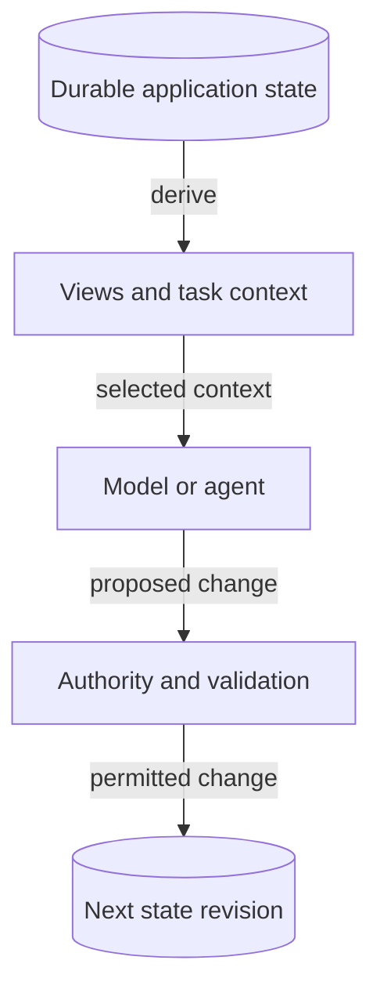
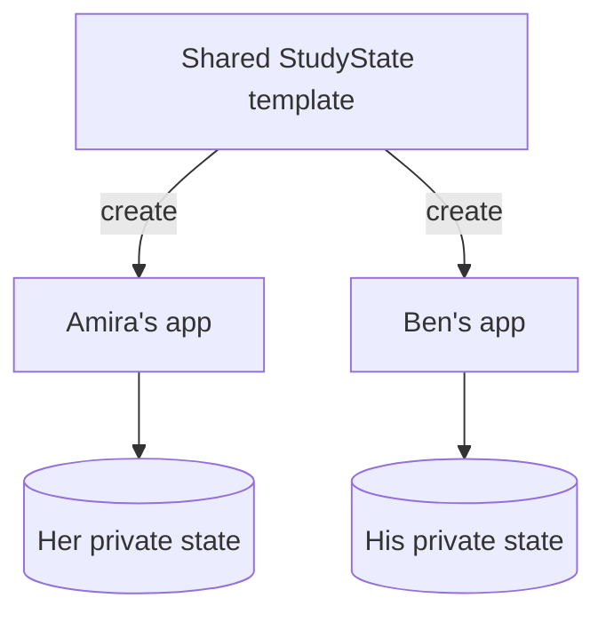
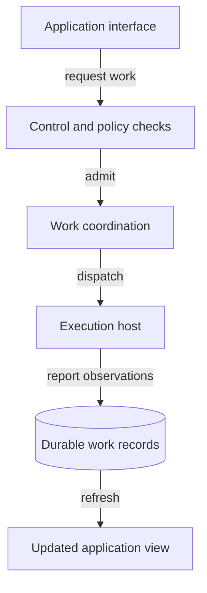
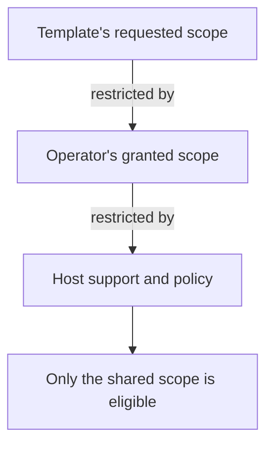
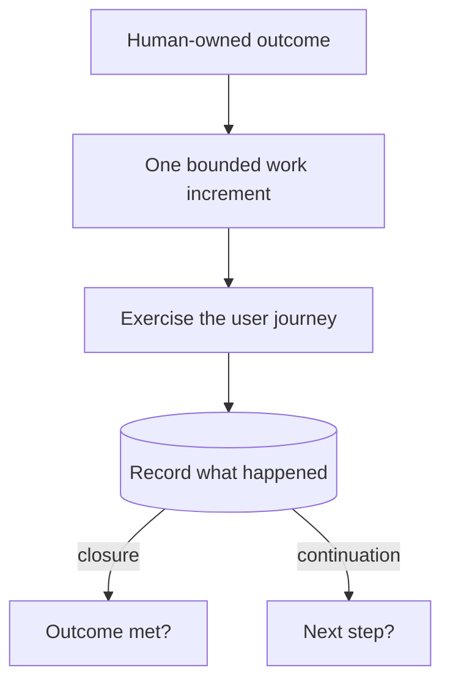
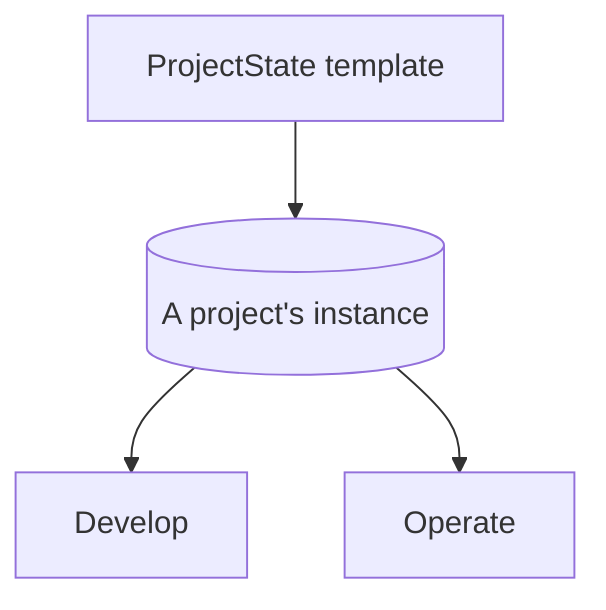
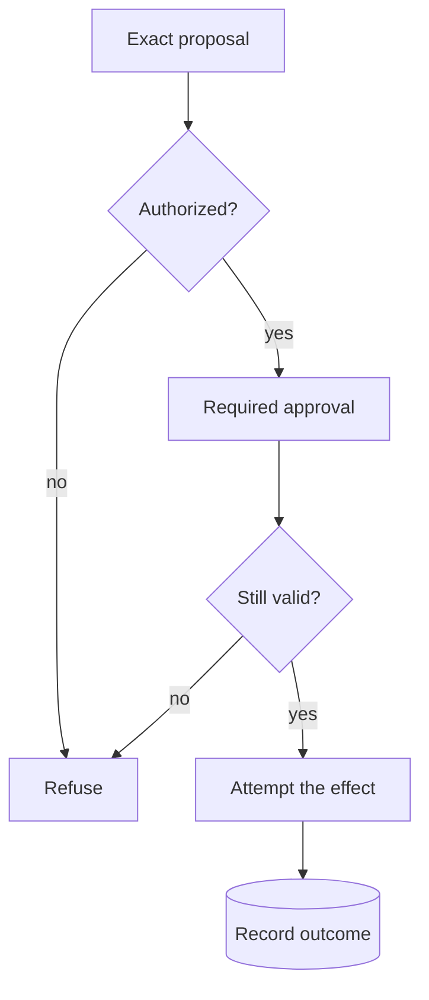
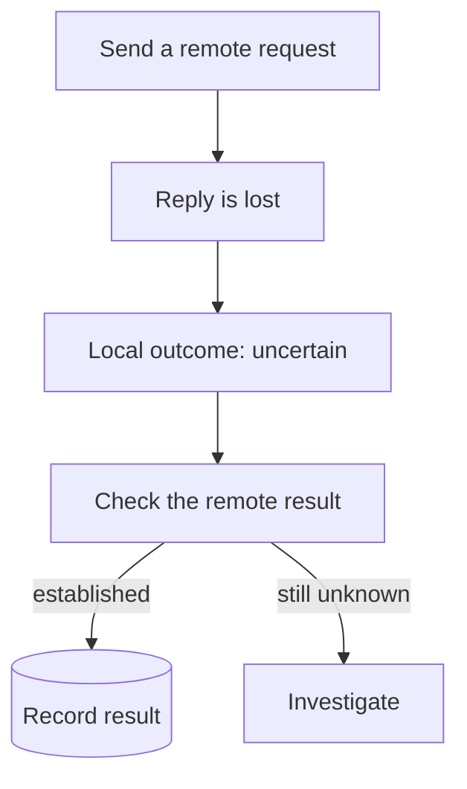
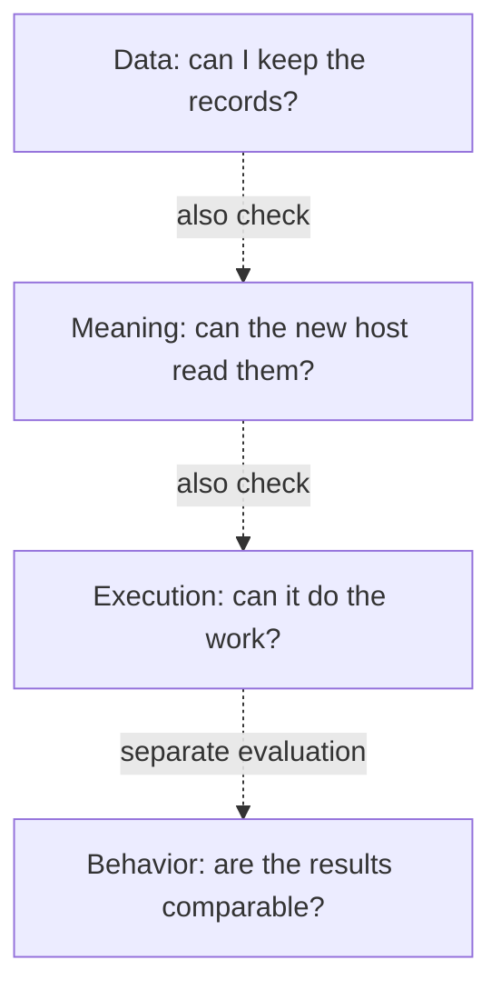
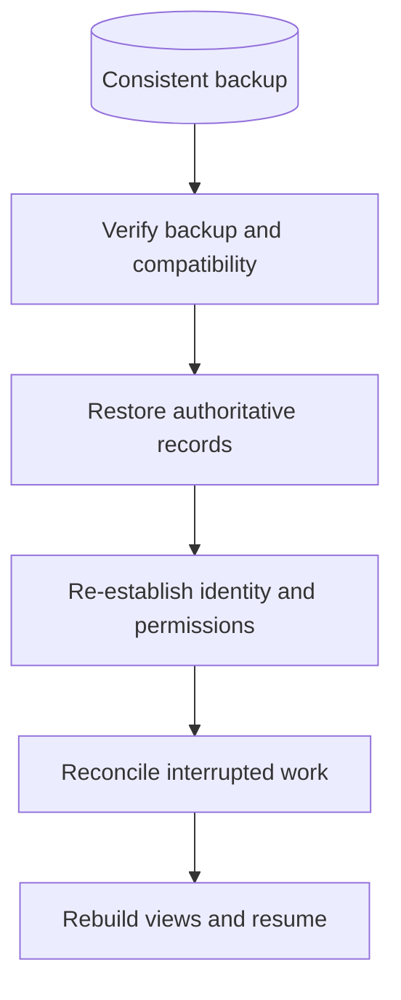

# 1. Abstract and thesis

## Abstract

AI-assisted work increasingly extends beyond a single exchange: a student follows a study plan, a developer maintains a product, a team revises a body of knowledge. The work accumulates goals, decisions, artifacts, permissions, and unresolved questions. A conversation can help produce that record, but it does not by itself establish which parts are authoritative or how another session should continue.

**Stateware** proposes an application boundary around durable state and the rules for changing it. The application retains its identity and useful work across sessions; interfaces present views of that work; models and agents act as replaceable processors within explicit authority. Governance supports continuity by making consequential changes attributable and reviewable. It is a means of sustaining useful work, not the purpose of the application.

This paper develops that model through StatePort, a platform for managing stateful AI applications, and ProjectState, a template for developing and operating projects around a human-owned outcome. A ProjectState instance carries the goals, decisions, work, and evidence of a particular project. StatePort itself was developed using such an instance; StatePort can also host ProjectState and StudyState instances as applications for ongoing project work and study.

The central claim is architectural: **the durable identity of an AI application should reside in its state and contracts, rather than in the session or engine currently acting on them.** This does not make model behavior deterministic, make every operation reversible, or establish that every implementation satisfies the model. It creates boundaries against which those properties can be examined.

## Scope

This is an architectural whitepaper, not a product manual or a comparative evaluation. “Should” and “must” describe requirements of the proposed model; they do not certify every StatePort code path. StatePort is an evolving reference implementation. Current availability and supported environments are maintained separately on the [release page](../releases/).

## A concrete example

Consider a study application. Its durable state includes the learner's objectives, agreed plan, completed exercises, reflections, and open questions. An AI session may propose a revised plan. The learner reviews the change where required, the application records the accepted revision, and the next session starts from that result. The conversation remains useful history, but a passing remark does not silently replace an agreed objective.

The same pattern applies to software development: an agent can change a program without changing what the owner asked the program to achieve. Keeping those two kinds of change distinct is one of the model's most consequential decisions.

Four names recur below. **Stateware** is the architectural idea. **StatePort** is the host for applications built around that idea. **ProjectState** supplies a template for project work; **StudyState** supplies one for study. An **instance** is the particular project or learner's working application, with its own state.

# 2. Why the boundary matters

The problem is not conversation itself. Chat is an effective interface, and systems can combine it with durable storage, versioning, and tool controls. The problem arises when the conversation becomes the implicit authority for work that needs a longer life.

Four questions reveal that boundary:

- **Continuity:** after a session ends, where are the current goal, decisions, and unfinished work?
- **Authority:** which record decides what may change, and who may revise that rule?
- **Evidence:** what distinguishes an intended action, an attempted action, and a checked result?
- **Independence:** what survives a change of model, interface, or hosting arrangement?

Adding more context does not answer these questions on its own. A larger transcript can retain contradictory decisions more faithfully without resolving which one governs. A summary can reduce reading cost while silently discarding a constraint. A memory index can retrieve relevant material without being qualified to decide its authority.

Stateware therefore separates the **record of work** from the **instruments of work**. The record must remain available when an instrument changes. An instrument must not acquire authority merely because it can read or summarize the record.

This is an application of familiar software principles—explicit state, separation of concerns, versioned interfaces, least privilege—to a setting in which a processor interprets natural language and can propose open-ended actions. The distinctive emphasis is on keeping the assistant's ongoing work coherent across those changing processors.

# 3. The application model

## 3.1 Durable state and derived views

**Canonical state** means the record the application treats as authoritative: the accepted plan, current artifact, granted permission, or recorded result. It need not be one file or database. The rule is that each fact has a clear home. If a dashboard disagrees with the accepted plan, the application knows which record to trust.

A conversation view, dashboard, search index, preview, and model context are projections of that state. They can be optimized for different purposes without creating competing versions of the truth. A projection should identify its inputs and, where relevant, their revision or freshness.

This distinction does not make all operational data disposable. Original messages, user uploads, approval decisions, execution journals, and external identifiers may contain facts that exist nowhere else. If the application needs those facts for continuity or recovery, they belong in durable storage. A rendered conversation can be rebuilt; an unrecorded user decision cannot.

```mermaid
flowchart TB
    accTitle: The work stays; the tools can change
    accDescr: Durable state supplies views and task context. The selected context informs a model or agent, which proposes a change. Authority and validation checks govern whether that change becomes the next revision of the same durable state.
    stateStore[("Durable application state")]
    stateStore -->|"derive"| projections["Views and task context"]
    projections -->|"selected context"| engine["Model or agent"]
    engine -->|"proposed change"| control["Authority and validation"]
    control -->|"permitted change"| updated[("Next state revision")]
```

The arrows show two different activities: reading state to prepare a view or task, and changing state through the appropriate controls. Replacing the model or rebuilding a dashboard should preserve the accepted work. This is the conceptual boundary, not a diagram of every implementation path.

**Context** is the material selected for a particular model task. For a study-plan revision, that might be the current plan, recent exercise results, and the learner's available time. It need not include every past conversation. When the task needs missing evidence, the engine should retrieve or request it through the permitted interface. What happens to remain in a model session does not become authoritative by default.

## 3.2 Definition and instance

An **application definition**, supplied by a template, describes reusable behavior, state structure, views, and requested capabilities. An **instance** is one owner's working application created from that definition. Two learners can use the same study template while keeping separate plans, histories, settings, and permissions.

```mermaid
flowchart TB
    accTitle: One definition, separate owned instances
    accDescr: A shared StudyState definition creates Amira and Ben instances. Each instance contains its own plan, progress, and decisions; neither learner shares private state merely by using the same template.
    template["Shared StudyState template"]
    template -->|"create"| amira["Amira's app"]
    template -->|"create"| ben["Ben's app"]
    amira --> aState[("Her private state")]
    ben --> bState[("His private state")]
```

The template author owns the reusable definition. The instance owner owns their working content and decisions. StatePort owns the mechanics by which a source is resolved, materialized, registered, inspected, and operated. Consuming or adapting a template does not transfer authorship of its content to the platform.

This separation makes updates intelligible. A new template release may change a workflow; it must not silently replace a learner's progress or a project's accepted scope. Ownership and provenance determine which material can be replaced, which must be preserved, and which needs an explicit migration or conflict decision.

## 3.3 Contracts and adapters

StateSpec names the portable template contract used within the StatePort architecture. A contract describes the structure and capabilities a host can recognize; it is not a universal promise that any agent can run any repository. Compatibility requires agreement on schemas, action semantics, authority, and runtime prerequisites.

StatePort uses **adapters** to work with supported formats such as ProjectState and StudyState. An adapter acts as a translator: it recognizes the template's structure, checks that it is valid, and exposes the operations the host knows how to handle. Reading a template successfully does not give its contents permission to run arbitrary commands.

The distinction matters for extensibility. A platform should be able to support a new domain without requiring every domain to adopt the same internal files. It still needs an explicit compatibility boundary: an unsupported operation remains unsupported, even when an agent can describe how it might work.

# 4. StatePort: hosting the lifecycle

StatePort gives the model a concrete division of responsibilities. These are logical roles, not a requirement to create a separate service for every concern.

```mermaid
flowchart TB
    accTitle: How a work request moves through StatePort
    accDescr: The interface submits a request to control checks. Admitted work is coordinated and executed; observed results are recorded in durable state and become visible through the interface. This is a conceptual permitted-work path, not a service topology.
    view["Application interface"]
    view -->|"request work"| api["Control and policy checks"]
    api -->|"admit"| worker["Work coordination"]
    worker -->|"dispatch"| host["Execution host"]
    host -->|"report observations"| records[("Durable work records")]
    records -->|"refresh"| updated["Updated application view"]
```

The interface asks; the control layer checks permission; coordination follows the work; the execution host performs it. The result must be recorded before a later session can reliably continue from it. A response in the interface alone is not that durable record.

| Responsibility | Architectural role | Boundary |
| --- | --- | --- |
| Application interaction | Web interface and application views | Present state and submit requests; do not receive host control sockets |
| Control | API and policy checks | Validate requests against instance identity, grants, and operation rules |
| Ongoing work | Worker and execution coordination | Track work and transitions durably; distinguish waiting, running, failed, cancelled, and completed work |
| Execution | Execution host and provider adapters | Run permitted work in the selected environment; report effects and failures |
| Lifecycle | Template resolution, instance catalog, update and recovery mechanisms | Preserve source identity, ownership, instance state, and recovery boundaries |
| Context and evidence | Context preparation, approvals, receipts, and durable records | Give engines relevant inputs and owners an inspectable account of changes |

## 4.1 Capability is an intersection

A template can request a terminal, file access, provider execution, or an external operation. That request describes what the application would like to do. The operator decides what to grant, and the host must be able and permitted to provide it. An operation is eligible only where all three agree.

```mermaid
flowchart TB
    accTitle: A request alone gives no permission
    accDescr: Effective authority is the shared scope of the template request, the operator grant, and host support and policy. Each restricts the request; if no shared permission remains, the operation is unavailable. Action-specific checks still apply.
    request["Template's requested scope"]
    request -->|"restricted by"| grant["Operator's granted scope"]
    grant -->|"restricted by"| host["Host support and policy"]
    host --> result["Only the shared scope is eligible"]
```

For example, a study template might request file access. The owner can grant access to one study folder; that does not grant access to the rest of the machine. The host must enforce that boundary when the action runs.

The execution environment supplies enforcement: restricted identities, filesystem access, network policy, and mediated interfaces where applicable. A browser must not receive the host control socket. A provider adapter must not turn subscription credentials into portable application state. Rootless execution and least privilege reduce exposure, but their presence is not proof that isolation is complete.

Useful interfaces make this distinction visible. “Declared,” “available,” “authorized,” and “successfully executed” describe different facts. A visible control or a selected provider cannot establish the last of them.

## 4.2 Durable orchestration

Longer work needs more than a request and a response. The system must know what was admitted, what began, what remains outstanding, and what evidence supports its current status. After interruption, it must recover from durable records rather than from an agent's recollection.

Cancellation illustrates the requirement. A cancellation request is an intention; a stopped process is an observation; preserved results and reconciled external effects are further facts. The interface should not collapse them into a single reassuring label.

For example, “cancel requested” should remain distinct from “execution stopped.” If a report was already written or a remote request already sent, cancellation must also account for that effect. A worker restart should recover those facts from the work record.

Recovery has an ownership boundary too. Discovering a container or directory does not establish permission to delete it. A host must distinguish resources it can attribute to the recovering instance from resources whose ownership is unknown. Uncertainty should lead to retention and an explicit recovery decision, not speculative cleanup.

## 4.3 One instance, multiple engines

An execution host can provide tools, sessions, context handling, and provider-specific behavior without becoming the authority for the instance's goals or private state. Replacing that host should preserve the work record, while making changed capabilities and prerequisites explicit.

Interchangeability is therefore conditional. Two engines may honor the same input contract and still differ in reasoning quality, tool behavior, authentication, latency, cost, or failure modes. Stateware aims to make replacement possible and inspectable; it does not promise equivalent outputs.

# 5. ProjectState: developing and operating projects

ProjectState applies the same concern for durable authority to developing and operating a project. The template provides the reusable structure; an instance holds the actual project and its ongoing work. Its v6 core is intentionally small: a human-owned outcome, one current slice of work, one representative user journey, and evidence of what actually happened.

| Canonical artifact | Responsibility |
| --- | --- |
| `PROJECT.md` | The user, outcome, scope, non-goals, and durable constraints owned by the human |
| `STATE.yaml` | One current slice, its acceptance criteria, primary journey, blockers, risks, and exact next action |
| `AGENTS.md` | Authority boundaries, working rules, and conditions for stopping and closure |
| `evidence/<slice-id>/summary.md` | Commands, environment, observed results, artifacts, and unresolved limitations |

The generated core also includes a small outcome checker and a README. Those six files do not represent six competing sources of current truth. The README explains the product; the checker examines recorded consistency. Backlogs, architecture decisions, release records, and additional controls are optional supporting material when the project needs them.

## 5.1 Outcome before administrative completion

A slice is a bounded increment toward the product outcome. Its primary journey is the smallest representative interaction that can show whether that increment works for the intended user. It is exercised early, then repeated when a relevant change invalidates its evidence.

This ordering prevents a common substitution: proving that code compiles or that a repository is orderly while leaving the user journey untested. Secondary checks can uncover additional blockers. They cannot reverse a failed, blocked, or unrun primary journey. If installation is part of the outcome, source-tree tests do not substitute for exercising the distributed artifact in the intended clean environment.

The outcome checker reads the recorded contract and evidence. It does not execute the journey, authenticate a human's approval, or establish that an assertion is true merely because the assertion is well formed. Its result is a consistency judgment over evidence, not an independent observation of the product.

The vocabulary follows that boundary: **implemented** means a change exists; **validated** means the named journey passed in the named environment; **published** requires separate delivery evidence; **accepted** requires the human's verdict.

```mermaid
flowchart TB
    accTitle: From the intended outcome to observed evidence
    accDescr: The human-owned outcome defines a bounded slice. The real user journey produces evidence. That evidence informs two separate questions: whether the outcome is satisfied and whether another work increment is justified.
    outcome["Human-owned outcome"]
    outcome --> slice["One bounded work increment"]
    slice --> journey["Exercise the user journey"]
    journey --> evidence[("Record what happened")]
    evidence -->|"closure"| closure["Outcome met?"]
    evidence -->|"continuation"| nextStep["Next step?"]
```

Imagine a change intended to let a learner reopen a saved study plan. A successful build shows that the program can be assembled. Closing and reopening the application, then finding the correct plan, checks the user's outcome. The evidence should say which of those was actually tested.

## 5.2 Continuing is a separate decision

Closure asks whether the recorded outcome is satisfied. Continuation asks whether another unit of work is justified. A successful check does not, by itself, authorize more work.

ProjectState's continuation rule asks the agent to identify the unchanged outcome or safety boundary being addressed, the information or behavior expected from the next action, and why that action is the smallest sufficient step. Repeated attempts need a changed premise. Expensive work needs feasible prerequisites and room for integration and reporting. After two evidenced failures at the same delivery boundary, the method calls for an assumption review and simplification before further expansion.

These rules constrain the process without turning persistence into an end in itself. A blocked dependency may justify waiting, replanning, or independent authorized work. It does not justify repeatedly polling an unchanged condition or indefinitely enlarging the system.

The rules are advisory unless an actual runner enforces admission. Writing a deadline in a file is not the same as preventing work after it. An explicit long run needs bounded work and a finalization reserve; parallel threads remain optional, with one coordinator responsible for integrated state and evidence. Neither threads nor model choices are activated by installing the template.

## 5.3 Development and operating use

A ProjectState instance can support both the development of a product and the ongoing operation of a project. In development use, it organizes the work of creating and improving something: the intended outcome, the current increment, the decisions made, and the evidence that the result works. StatePort itself was developed using a ProjectState instance.

In operating use, the instance remains the working home of the project: maintaining its goals, planning and carrying out work, reviewing results, and deciding what comes next. Its purpose extends beyond producing software. Just as a StudyState instance supports a learner's ongoing study, a ProjectState instance supports ongoing project work, with continuity across sessions and agents.

StatePort can host a ProjectState instance in either use. ProjectState and StudyState supply the structure and behavior of their respective domains; StatePort supplies the application interface, lifecycle, and governed execution. The instance preserves the project's history as its work develops and continues in operation.

```mermaid
flowchart TB
    accTitle: One ProjectState instance, two uses
    accDescr: A ProjectState template creates a project instance that holds the actual goals, decisions, and history. The instance supports both development and operating work. These are uses of the instance, not mandatory stages or separate applications.
    projectTemplate["ProjectState template"]
    projectTemplate --> project[("A project's instance")]
    project --> development["Develop"]
    project --> operating["Operate"]
```

Both kinds of instance retain goals, decisions, and results across sessions. The branches describe uses of the instance; they do not require a separate application or a fresh start when the work changes.

# 6. Change, authority, and evidence

## 6.1 From intent to a recorded result

A governed change has distinguishable stages: proposal, authority check, approval where required, validation, application, and recording. The proposal describes the intended effect. Authority determines whether that effect is permitted. Validation checks relevant preconditions and invariants. Execution attempts the effect. The record preserves what was observed.

Approval should bind to the action and state actually reviewed. If the proposal changes, a grant expires, or relevant state has moved, the system must determine whether approval still applies before execution. Otherwise, an exact-looking approval interface can authorize something the owner never saw.

A standing grant can cover a bounded class of routine work. A fresh confirmation is needed when the action falls outside that authority or policy requires a specific decision. Repeatedly asking for an already authorized, unchanged action adds friction without strengthening the boundary.

```mermaid
flowchart TB
    accTitle: An approved intention still needs a checked execution
    accDescr: A proposal is checked against authority. A permitted proposal uses existing authority or receives any required approval, then passes validation before an execution attempt. The system records observed outcomes. Refusal or invalidation prevents the attempt; an attempted effect can still fail or remain uncertain.
    proposal["Exact proposal"]
    proposal --> authority{"Authorized?"}
    authority -->|"yes"| approval["Required approval"]
    authority -->|"no"| stop["Refuse"]
    approval --> validation{"Still valid?"}
    validation -->|"yes"| execute["Attempt the effect"]
    validation -->|"no"| stop
    execute --> receipt[("Record outcome")]
```

The approval step must be satisfied before proceeding: a required decision that is pending or denied does not allow execution. “Attempt” is deliberate wording—the action can succeed, fail, or leave an outcome that still needs investigation.

## 6.2 Agents can act, but not define their own authority

“The agent proposes, the system applies” is a useful description of a governed mutation boundary. It should not be mistaken for a claim that an agent never executes a tool or writes in a workspace. Coding agents do both. The engineering requirement is that their effective access is bounded independently of their instructions and that promotion into protected state follows the applicable controls.

A prompt asking an agent to behave is not an authorization mechanism. Repository text and retrieved content are inputs to interpret, not permissions to widen access. The component that enforces a grant must not accept an agent's assertion that the grant has changed as sufficient evidence of that change.

## 6.3 Receipts have a scope of trust

A receipt records an operation: its identity, relevant inputs, authority, observed transitions, checks, and result. It helps distinguish an attempt from a completed effect and a checked effect from human acceptance.

A receipt is still produced by software. Its value depends on the recorder's integrity, the evidence it references, and the coverage of the checks. A signature can establish origin and integrity relative to a trusted key; it cannot establish that an answer is correct or that a test was adequate. Receipts support scrutiny rather than eliminating the need for it.

For external effects, recording and execution may fail separately. Suppose a remote service accepts a request just before the connection drops. The local system cannot yet tell whether it succeeded. The outcome is **uncertain**, not necessarily failed. Recovery may use a request identifier that prevents duplicates, query the remote service, or require human investigation. Retrying blindly can repeat the effect.

```mermaid
flowchart TB
    accTitle: A missing reply is not proof of failure
    accDescr: A remote request may have been accepted when its reply is lost. The local outcome remains uncertain until checking the remote result or human investigation establishes what happened. Retry decisions come after reconciliation.
    request["Send a remote request"]
    request --> lost["Reply is lost"]
    lost --> unknown["Local outcome: uncertain"]
    unknown --> inspect["Check the remote result"]
    inspect -->|"established"| record[("Record result")]
    inspect -->|"still unknown"| review["Investigate"]
```

## 6.4 Local transactions do not make the world transactional

A validated file change can often be applied atomically within a suitable storage boundary. Sending a message, spending money, or changing remote infrastructure may not be reversible. A plan that spans several systems needs explicit partial-failure handling; a local rollback does not undo an external event.

Failing closed means refusing new effects when required authority or preconditions cannot be established. It does not mean pretending that an already attempted effect never happened. Uncertain outcomes must remain visible, with enough evidence to reconcile them safely.

# 7. Lifecycle, portability, and recovery

The lifecycle is the application's life over time: install a definition, create an instance, use it, review what happened, update it, back it up, and recover when needed. Throughout that life, the platform must distinguish template content from the owner's private work, permissions, and disposable generated views.

## 7.1 Install and update

Installation selects and verifies an identified source, creates the instance from it, and records where that content came from. A mutable discovery label can help someone find a release; the installed instance still needs an exact identity. The template requests capabilities, and the operator determines the effective grant.

An update compares the new definition with the instance's existing content and the rules for who owns each part. Conflicts, schema changes, and altered capability requests are decisions to expose. Updating the platform, updating a template, and migrating private instance data are related but distinct operations; one successful package replacement does not prove all three succeeded.

## 7.2 Portability has several layers

**Data portability** preserves readable state and artifacts. **Semantic portability** preserves their meaning across schema and contract versions. **Execution portability** requires a compatible host, tools, dependencies, and credentials. **Behavioral equivalence** would require comparable outcomes from different engines and is a stronger claim still.

The first layer does not imply the others. Copying a directory may preserve useful work while leaving an external integration unavailable. A destination may need new grants because permissions are local to its operator and environment. Credentials should be provisioned through supported authentication paths, not silently copied into a portable bundle.

This qualified view of portability is still valuable. It separates what the owner can retain from what must be re-established, making the cost of moving visible rather than promising that moving has no cost.

```mermaid
flowchart TB
    accTitle: Moving the files is only the first question
    accDescr: Portability asks separate questions about retained data, preserved meaning, available execution, and comparable behavior. Passing one question does not prove the next.
    data["Data: can I keep the records?"]
    data -.->|"also check"| meaning["Meaning: can the new host read them?"]
    meaning -.->|"also check"| execution["Execution: can it do the work?"]
    execution -.->|"separate evaluation"| behavior["Behavior: are the results comparable?"]
```

A copied study plan may remain readable on a new machine while its chosen provider is unavailable. The work has moved; the ability to continue every action has not yet been established.

## 7.3 Backup is a consistency problem

A useful backup includes every authoritative record required to recover the instance, at a mutually consistent point. Depending on the application, this may include files, database state, manifests, ownership metadata, and execution records. A copy made during active mutation is not automatically such a snapshot.

Recovery must verify the backup, restore compatible state, re-establish identity and permissions, and reconcile interrupted work. Disposable projections can then be rebuilt. A restore rehearsal is stronger evidence of recoverability than the existence of an archive.

```mermaid
flowchart TB
    accTitle: Recovery restores a coherent working instance
    accDescr: Create a consistent snapshot of authoritative records. Recovery verifies the backup, restores compatible state, re-establishes identity and permissions, reconciles interrupted effects, and rebuilds derived views before resuming.
    snapshot[("Consistent backup")]
    snapshot --> verify["Verify backup and compatibility"]
    verify --> restore["Restore authoritative records"]
    restore --> access["Re-establish identity and permissions"]
    access --> reconcile["Reconcile interrupted work"]
    reconcile --> views["Rebuild views and resume"]
```

This is the successful recovery path. If integrity, compatibility, or ownership cannot be established, stop at that step and retain the evidence. Rebuilding a dashboard cannot repair a missing decision or an unknown external effect.

The owner can still lose data through an incomplete backup, an unrecorded effect, a compromised host, or a mistaken deletion. Stateware makes the required boundaries explicit; durability remains an engineering property to test.

# 8. Tradeoffs and questions for evaluation

Explicit state and governance have costs. Data formats evolve. Adapters need maintenance. Receipts consume storage. Context preparation can omit relevant material. Isolation can prevent useful work when its permissions are too narrow. Excessive confirmations can train people to approve without reading.

The design response should be proportionality. Keep canonical records small enough to understand, preserve detailed evidence where needed, and add controls for a concrete consequence. Routine safe work should fit within bounded grants. Additional services, ledgers, and mandatory process artifacts should earn their cost by resolving a real uncertainty.

Local ownership also does not imply zero disclosure. When an external provider processes selected context, that context crosses a trust boundary. Data minimization, explicit attachments, secret handling, retention, and provider policy remain separate concerns. Readable state can contain sensitive information just as readily as any other storage format.

The model can be evaluated through concrete questions:

- Can a new session resume the actual work without relying on hidden conversational memory?
- Can an owner distinguish authoritative state from a stale or incomplete projection?
- Does a denied operation leave protected resources unchanged, and does an uncertain external effect remain visible?
- Can a template update preserve private content and expose conflicts before applying them?
- Can a backup restore a usable instance, including interrupted-work reconciliation?
- Can an engine be replaced while retaining the work record and exposing capability differences?
- Does the full system deliver useful work within the target machine's resources, with acceptable effort from its owner?

These questions require observable journeys, interruption tests, and measurements. A feature inventory or a collection of passing component tests cannot answer them alone. Comparative claims about speed, cost, reliability, or user attention require a defined baseline and evidence; this paper makes no such measured claim.

Open design questions include concurrent writers, migration between contract versions, evidence retention under privacy constraints, and how to explain a meaningful approval without overwhelming its reader. A shared ecosystem would also need conformance tests across independent hosts. A named specification alone does not establish interoperability.

# 9. The bet

The value of an AI application accumulates in the work it helps someone carry forward: a clearer plan, a maintained system, a body of knowledge, a sequence of decisions they can still understand. That value should not have to be reconstructed whenever a session ends or an engine changes.

Stateware places durable state and explicit contracts at that boundary. StatePort explores how to host and operate applications around it. ProjectState applies the same discipline to developing and operating projects: preserve the human's outcome, work in bounded increments, and let observed results outrank administrative success.

The proposal is not that state removes uncertainty. It is that uncertainty, authority, and continuity should have places in the application that its owner can inspect. Models can improve and interfaces can change while the work remains something the owner can keep.

**State is the application boundary.**

# Reading and provenance

This revision reflects the StatePort architecture and ProjectState v6 core reviewed on 9 September 2026. It supersedes the earlier text at this public URL; the separate July v1.2 candidate is a historical draft, not a newer architectural reference. The filename is retained so existing links continue to work.

The architectural account is grounded in StatePort's template adapter, persistent application, execution-host, and lifecycle code, and in ProjectState's core contract, initializer, outcome checker, and upgrade guidance. The editorial review record is maintained with the site's evidence. These sources establish the design and implementation vocabulary; they do not substitute for qualification of every described behavior.

For implementation-facing explanations, see the [application model](../docs/model.html), [template lifecycle](../docs/templates.html), [governance](../docs/governance.html), [security and privacy](../docs/security-and-privacy.html), and [recovery](../docs/lifecycle.html). The [evidence and roadmap guide](../docs/evidence-and-roadmap.html) explains how to assess product claims. Software availability belongs on the [release page](../releases/).

## Authorship

Lennert Van Hoyweghen defines the model and its product direction. Coding agents assist with implementation, analysis, and editorial revision. Their participation does not transfer ownership of the outcome, acceptance criteria, or final product judgment from the human.
