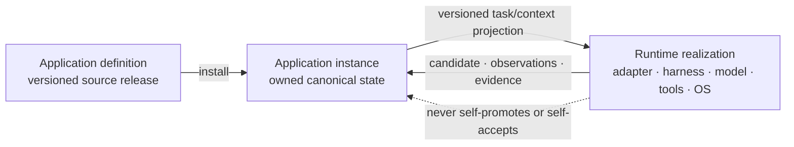
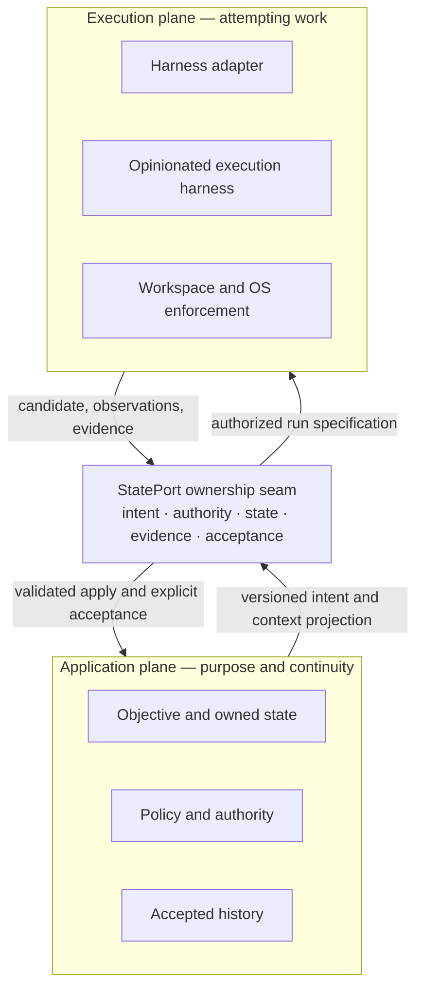
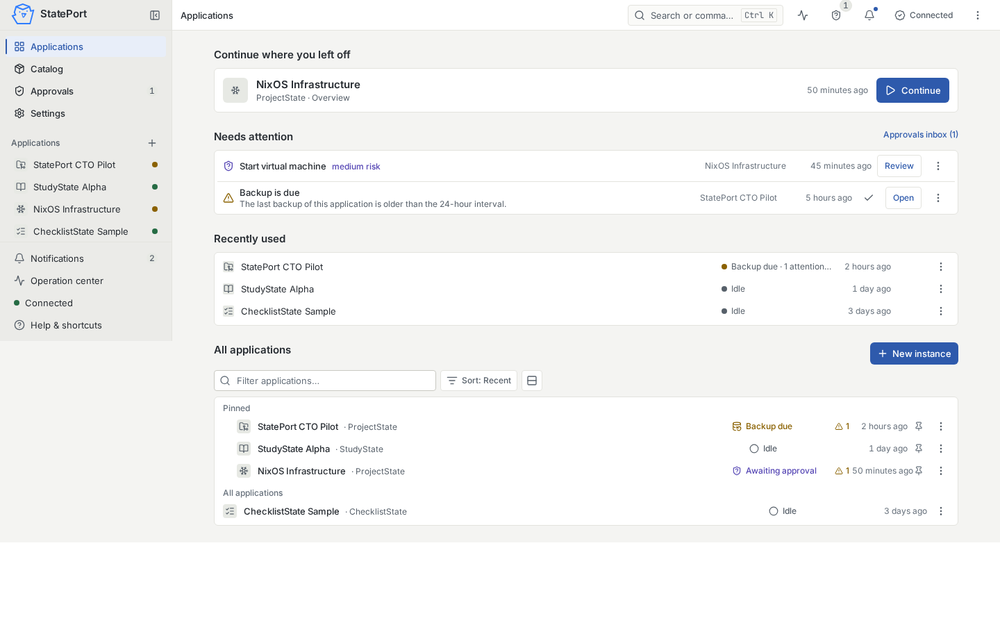
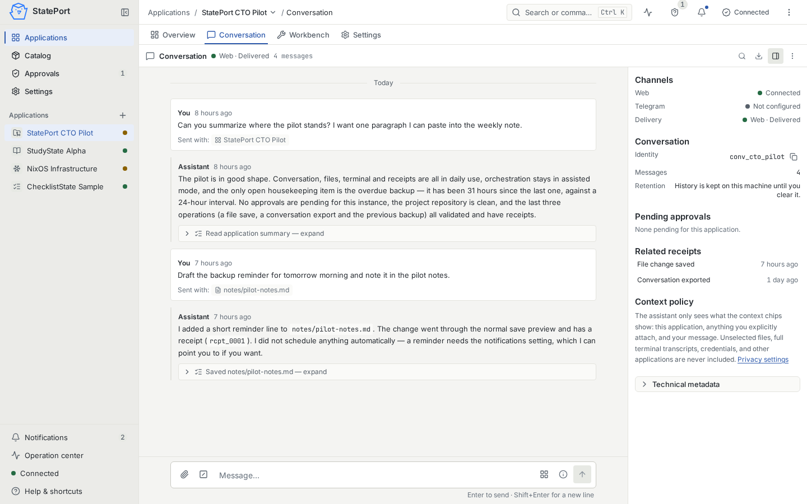
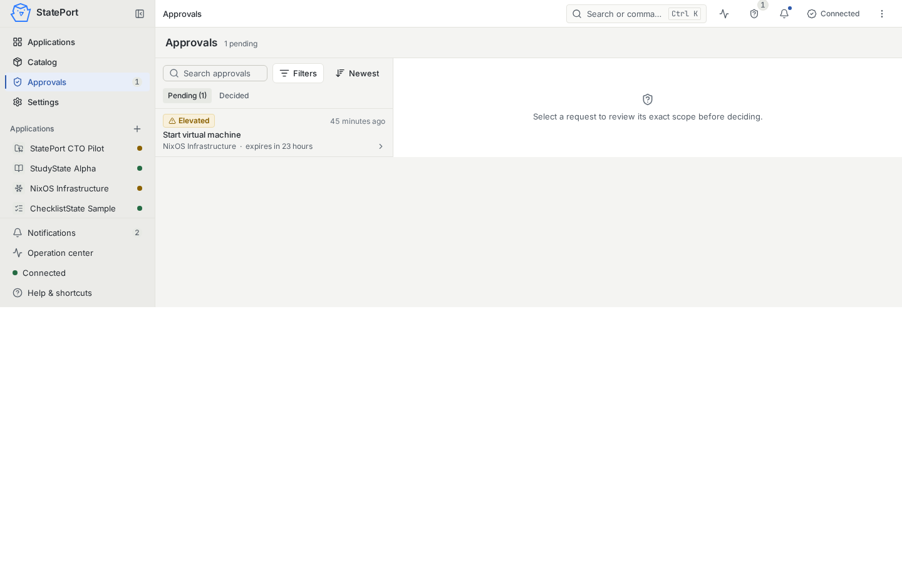

# 1. Abstract, thesis, and standing

## Abstract

AI assistants are often experienced through sessions: a chat, an IDE panel, a
terminal process, or an autonomous coding workspace. Those sessions can be
useful, but they are weak places to keep the durable identity of an application.
They may compact context, change tools or models, retain data under provider
rules, and disappear without leaving a complete account of what was intended,
authorized, observed, validated, or accepted.

This paper presents **Stateware**: a model in which canonical, user-controlled
state forms the durable authority and continuity substrate of an AI
application. State is not claimed to determine all behavior. An application
also has a versioned definition, an effective policy, and a runtime realization
whose execution harness, model, tools, operating environment, and external
services affect what happens. The model preserves that distinction instead of
hiding it behind the word “agent.”

StatePort is the private local reference implementation used to test the model.
It combines two product planes. The **application plane** gives named,
continuing applications a durable place to hold goals, decisions, owned state,
and accepted history. The **execution plane** activates work through an
opinionated coding-agent harness in a supervised environment. Their ownership
seam is the central product contract:

> **StatePort owns intent, authority, canonical state, evidence, and
> acceptance. The harness owns execution behavior, but it must never silently
> become the source of truth.**

The paper makes no measured performance, market-superiority, security
certification, or legal-compliance claim. It proposes an application boundary,
states what that boundary does and does not preserve, and identifies the tests
that a real product must pass before the thesis is credible.

## Central thesis

> **Canonical state is the durable application boundary, not the totality of
> application behavior.**

The distinction matters. If a provider session disappears, the application’s
objective, owned facts, decisions, policies, provenance, and accepted history
should remain. A new runtime should be able to reconstruct declared context and
continue meaningful work. But a new harness or model need not choose the same
plan, emit the same tool calls, present the same evidence, or carry the same
security posture. Continuity is a defensible promise; behavioral equivalence is
not.

This is stronger than “assistants need memory” and narrower than “files are the
whole application.” It asks:

- What is authoritative?
- Which definition and policy give the state meaning?
- Who may propose, execute, apply, validate, and accept a change?
- What is declared authority, and what does the environment actually enforce?
- Which observations came from the harness, the operating system, an
  independent validator, or a human?
- Can work continue after every provider session and runtime process is gone?
- What survives a provider change, and what must be requalified?

## Standing of the StatePort evidence

This v1.2 file is a **private review candidate**. It does not replace public
v1.1, announce a release, or establish product-owner or external acceptance.
Availability remains a release-ledger question.

The classifications below deliberately separate an architectural contract from
implementation evidence:

| Claim area | Candidate standing |
| --- | --- |
| Stateware category and ownership seam | Proposed architectural model |
| Application-first shell, canonical StateSpec instances, source identity, approvals, receipts, local backup/recovery, and bounded local execution | Private implementation with local machine-test evidence; exact candidate identity must be supplied by the release ledger |
| Current coding-agent path | Codex, locally exercised in **supervised-direct** mode; not a claim of transactional execution |
| Human-driven and approval-gated journeys | Locally exercised in bounded flows |
| Human-on-the-loop domain operation | Architectural target with partial grant-driven/local-reminder foundations; a proactive domain-real journey is not yet proven |
| Pi, OpenCode, or direct-API execution | Not qualified as current supported execution paths |
| Provider replacement | State and contract continuity are the target; behavioral, security, and evidence equivalence are not promised |
| Clean external installation, remote candidate CI, independent security review, external-user acceptance, public source, or public release | Not established by this paper |

# 2. The problem: sessions are useful but insufficient

The session-centric model is not a mistake. Conversation is a general and
accessible interface, and coding-agent workspaces can perform substantial work.
Many products also provide history, memory, export, project instructions, or
remote execution. The claim here is therefore not that every existing system is
stateless or that every provider traps all data.

The narrower problem is that the durable application boundary is often unclear.
Important state may be split among a transcript, a provider database, a local
checkout, hidden context, an agent summary, a task tracker, and facts remembered
only by the user. Four failures follow when no declared object and lifecycle
join those pieces.

## 2.1 Continuity is provider- or session-dependent

Session history can be compacted, truncated, archived, or interpreted through a
new model and tool configuration. An export may preserve text without preserving
the operational contract needed to continue. A user has data, but may not have
a self-contained application that another conforming runtime can understand.

Research on local-first software frames user control, longevity, and continued
operation without a service as first-class product properties rather than
afterthoughts.[^local-first] Stateware applies the same instinct to AI
applications while acknowledging that owned data alone does not reproduce every
runtime behavior.

## 2.2 Definition, instance, and runtime are entangled

A system prompt, accumulated thread, model selection, tool policy, and working
files may jointly determine how an assistant behaves. If these are not separated,
there is no precise answer to:

- what reusable application was installed;
- which facts belong to this particular owner;
- which provider-specific choices affected this run;
- what an update may replace;
- what must be preserved or migrated.

Git demonstrates the usefulness of immutable, content-identified objects and
explicit references for reconstructing exact versions.[^git-data-model] Git is
not by itself an AI-application lifecycle, but its discipline is a useful part of
one.

## 2.3 Assertions, observations, and acceptance collapse

A harness saying “done” is an assertion. A process exit code is an observation.
A test result is validation under declared conditions. Applying a candidate to
canonical state is another event. Human acceptance and public shipment are
different again.

When these states collapse into one completion message, the user cannot tell
whether work was attempted, produced, tested, applied, accepted, or released.
The transcript records a story; it does not automatically establish the chain
of evidence.

## 2.4 Portability is described too broadly

Moving files is different from reproducing execution. A second provider may
accept the same task and state projection while differing in model routing,
system instructions, context compaction, tools, approval behavior, retry logic,
filesystem semantics, or result shape. State can remain portable even when
behavior does not.

The model therefore needs several portability levels rather than a one-click
provider-equivalence promise. Section 4 defines them.

## 2.5 The common root

These failures share a boundary problem: durable application truth, reusable
definition, noncanonical operational records, and runtime behavior are not
named separately. Stateware reverses that ambiguity. It makes canonical state
explicit, binds it to a definition and policy, and treats every runtime as an
identified realization rather than an invisible container of truth.

# 3. The Stateware model

## 3.1 State is authoritative, not behaviorally complete

A Stateware application instance has canonical state: durable, readable,
user-controlled material that records its objectives, owned facts, decisions,
policy bindings, provenance, and accepted history. That state is the authority
for application continuity. A provider transcript, harness summary, browser
cache, process memory, or model recollection may not override it.

Observed behavior, however, is produced by more than state:

```text
observed behavior = f(
  application definition and version,
  canonical instance state,
  effective policy,
  context projection,
  harness and adapter,
  model and reasoning configuration,
  tools and authentication route,
  operating environment and isolation,
  external services,
  time and nondeterminism
)
```

Canonical state preserves identity, authority, and the accepted basis for
continuation. It does not make a probabilistic, tool-using runtime deterministic.

## 3.2 Application definition, instance, and runtime realization

Three nouns carry different responsibilities:

| Object | Meaning | Durable authority |
| --- | --- | --- |
| **Application definition** | A reusable, versioned package: workflows, schemas, declared capabilities, views, policies, and reference material | Its identified canonical source and immutable release |
| **Application instance** | One installed, owned copy: this learner’s study application or this project’s engineering application | Canonical instance state plus its exact definition/source binding and owner policy |
| **Runtime realization** | The currently selected StatePort service, adapter, harness, model, tools, credentials route, OS boundary, and external dependencies | None by default; it is an identified execution realization, not application truth |

The public product may say “application” when referring to the owned installed
thing. Technical records must say which of the three they mean.



## 3.3 Three classes of state

Not every durable record is canonical, and not every projection is reconstructible
from canonical state alone.

1. **Canonical application state** contains authoritative domain truth and the
   bindings required by the application’s lifecycle.
2. **Durable noncanonical operational records** may include transcripts,
   provider events, support bundles, logs, candidate artifacts, or indexes.
   They can aid continuity and audit without becoming domain authority.
3. **Ephemeral projections** include browser render state, disposable context
   packs, temporary workspaces, process output buffers, and caches.

A conversation view may combine canonical facts with a noncanonical transcript
and ephemeral UI state. Losing the transcript may lose convenience or an
operational record; it must not silently rewrite canonical domain truth. An
important user-visible claim should identify which source supports it rather
than implying that every pixel is mechanically derived from one file tree.

## 3.4 Application plane and execution plane

StatePort is the composition of two equally real planes:



The application plane answers *why this work exists, what remains true, and what
the user owns*. The execution plane answers *how one selected provider attempts
the work now*. The Workbench belongs to the second plane and may be useful, but
ordinary application value must not depend on a user operating it.

The ownership seam is exact:

| Concern | Canonical owner |
| --- | --- |
| Objective and accepted intent | StatePort application plane |
| Requested, granted, and effective authority | StatePort records the contract; the environment enforces what is technically enforceable |
| Canonical application state | StatePort lifecycle |
| Execution strategy, internal planning, and provider-specific behavior | Selected harness |
| Process, filesystem, network, and resource enforcement | Operating environment under StatePort policy |
| Observations and evidence classification | StatePort, using provider and environment inputs without treating them as equal |
| Validation and application policy | StatePort and the installed application definition |
| Human acceptance and shipment | Authorized human or release process, never the harness |

## 3.5 Canonical mutations and external effects

Every **canonical state mutation** must have a typed path: proposed intent,
authority decision, exact base identity, candidate, validation, application,
and receipt. That does not mean every runtime action is itself a database-style
transaction. A harness may execute tools in a staging workspace, and the current
supervised-direct mode may write directly within its declared workspace.

External effects require separate honesty. Sending a message, charging an
account, provisioning a machine, or publishing content cannot be rolled back by
restoring files. Such actions require explicit authority, idempotency or
compensation where available, and a receipt that says when rollback is not
possible.

# 4. Execution providers and portability

## 4.1 Harnesses are opinionated

A coding agent is not merely a model endpoint. Its harness selects or influences
system instructions, planning, tool exposure, approvals, context management,
retries, session behavior, model choice, and output interpretation. Provider
documentation makes these differences visible: Codex exposes per-run model,
approval, sandbox, and writable-directory controls; GitHub Copilot runs coding
work in a configurable ephemeral environment; OpenCode defines its own tool and
permission semantics.[^codex-cli] [^copilot-environment] [^opencode-permissions]

An adapter can translate a common task contract. It cannot erase hidden provider
semantics or manufacture guarantees that the provider and operating environment
do not supply.

## 4.2 Five portability levels

| Level | Meaning | Stateware position |
| --- | --- | --- |
| **State/package portability** | A conforming implementation can read the identified definition and owned canonical state | Required design goal |
| **Execution compatibility** | An adapter can receive the task contract and return a classified result | Conditional on declared provider capabilities |
| **Behavioral equivalence** | Two providers choose materially identical plans, tools, edits, and answers | Not promised |
| **Security equivalence** | Two providers and their environments enforce the same safety boundary | Not promised; each realization must be evaluated |
| **Evidence equivalence** | Two providers expose observations with identical completeness and trust | Not promised; degradation must be explicit |

Changing provider is therefore a **qualification event**, not a configuration
toggle with an equivalence guarantee. The application’s identity and canonical
state may remain stable while its execution characteristics change.

## 4.3 Execution fingerprint

Every run should record enough identity to explain its realization:

- execution provider and version;
- adapter and contract version;
- model and relevant reasoning configuration;
- authentication route without secret material;
- tool set and permission profile;
- sandbox or isolation mode;
- context-selection policy and source digests;
- base application revision and workspace identity;
- network and filesystem authority;
- retry, timeout, and cancellation policy.

This fingerprint supports comparison and incident analysis. It does not make two
runs reproducible in the deterministic sense.

## 4.4 Execution modes

StatePort distinguishes three modes:

| Mode | What happens | Claim boundary |
| --- | --- | --- |
| **Transactional** | The provider works in isolated staging; StatePort validates and promotes an exact candidate | Canonical apply can be governed atomically within the declared transaction boundary |
| **Supervised-direct** | The provider may write directly inside the selected workspace while StatePort supervises and records | Direct writes are not retroactively transactional; current local Codex integration uses this label |
| **Read-only advisory** | The provider reads declared inputs and returns advice or a candidate description | No canonical write authority |

The current private alpha must not imply that transactional execution is already
the universal path. Pi, OpenCode, and direct API remain unqualified until an
exact adapter, capability profile, conformance result, and release decision say
otherwise.

## 4.5 Declared, effective, and observed authority

Authority has three different forms:

1. **Declared authority** is what application, owner, and operator policy permit.
2. **Effective authority** is what mounts, credentials, process identity,
   network rules, container or VM controls, and the host OS technically allow.
3. **Observed behavior** is what evidence shows happened during one run.

A prompt is not an enforcement boundary. A declaration that says “network
denied” is not an enforced guarantee if the process can still reach the network.
Container specifications define a configurable execution environment and
lifecycle; the actual security properties depend on the chosen configuration
and host enforcement.[^oci-runtime] StatePort must report gaps rather than
turning requested policy into a security claim.

# 5. Human oversight as per-action policy

Governance is not the purpose of a Stateware application. It is the control
layer that lets a continuing application be useful without making the human its
workflow engine.

## 5.1 Classify the action, not the whole application

Oversight should depend on consequence, reversibility, sensitivity, uncertainty,
external side effects, cost, frequency, and owner preference. One StudyState
instance might reorder tomorrow’s review queue routinely, ask before changing a
certification target, and prohibit sharing learner data entirely.

| Mode | Per-action meaning | Example |
| --- | --- | --- |
| **Human-driven** | Work begins because a person requests it | Explain a difficult topic |
| **Human-in-the-loop** | Execution pauses at a defined decision point | Approve publication, deletion, deployment, or external communication |
| **Human-on-the-loop** | Routine bounded work proceeds while a person can observe, interrupt, redirect, or reverse it | Adapt a study-review queue and surface exceptions |
| **Bounded autonomy** | Work may initiate within explicit authority, budgets, limits, and escalation rules | Run tests and prepare a candidate change for review |

These are policy modes for actions, not permanent labels for applications.
NIST’s AI Risk Management Framework calls for documented human-AI roles,
context-specific oversight, monitoring, and evaluation rather than one universal
control pattern.[^nist-rmf] For legally defined high-risk AI systems, Article 14
of the EU AI Act provides a more specific human-oversight obligation; citing it
does not make Stateware compliant or classify every Stateware use as high
risk.[^eu-ai-act]

## 5.2 Honest current boundary

The StatePort private candidate has evidence for human-requested and
approval-gated flows, plus foundations for bounded grants and local reminders. That is
not yet proof of a domain-real, proactive human-on-the-loop application operating
over time. Bounded autonomy is future scope. Neither inherits release trust from
this architecture.

## 5.3 The governed lifecycle

A truthful action lifecycle is:

```text
requested
→ authorized
→ executing
→ candidate_produced
→ validated
→ applied
→ human_accepted
→ shipped
```

Not every action reaches every state. A read may end after an observation. A
rejected proposal stops before execution. A provider failure produces no false
assistant result. An applied result may remain unaccepted, and an accepted result
may remain unshipped.

Routine reversible actions may bypass an ask-every-time approval when an exact
standing grant covers them. Consequential or uncertain actions escalate. The
user can pause, cancel, or redirect where the runtime supports it, and any
inability to cancel or reverse must be visible before reliance.

# 6. The lifecycle of an owned application

An abstraction becomes a product only when one instance can be installed, used,
understood, updated, moved, backed up, and recovered without losing authority.

## 6.1 Install

Installation resolves an exact application-definition release, verifies its
identity and source, records provenance, materializes a fresh instance, and
computes effective capability from application request, instance grant, and
operator policy. An unresolved development candidate may be isolated for tests;
it is not silently installable as a canonical release.



## 6.2 Use and understand

The person opens a named application and sees its objective, what changed, what
needs attention, what is proposed, what is validated, and what has been accepted.
Conversation belongs inside that application. It may be a valuable operational
record without becoming canonical domain truth.



Technical tools use progressive disclosure. A development application may expose
a file viewer, terminal, editor, or run inspector when capability and authority
permit them. StudyState should remain useful without a Workbench.

## 6.3 Update

An update binds the current instance revision, the exact new definition release,
file ownership, migrations, protected owner state, and a rollback or truthful
non-rollback plan. Provenance makes many decisions mechanical, but not every
merge is automatic. Conflicts, schema changes, and owner overrides may require
review.



## 6.4 Move and change execution target

Moving an instance is a validated export/import or replication operation, not
merely copying whatever directory happens to be open. The portable unit must
identify the definition release, canonical state, ownership, schema versions,
attachments, and required migrations. Credentials remain outside the portable
state and must be rebound through supported authentication routes.

An execution workspace on another machine or in a container is an execution
substrate. By default it receives a versioned projection and returns candidates,
observations, and evidence:

```yaml
state:
  canonicalAuthority: stateport_controller
  remoteWorkspaceCanonical: false
```

A persistent remote canonical instance would be a different product mode and
would require explicit replication, conflict, and ownership semantics.

## 6.5 Back up

A trustworthy backup is a consistent snapshot, not an optimistic directory
copy. It should bind instance identity and revision, use single-writer or
quiescence guarantees where required, include an inventory and digests, publish
without replacing an unrelated archive, and pass validation before it is called
usable.

Database systems need concrete locking, journaling, flush, and recovery mechanics
to make atomicity survive interruption; atomicity is not created by calling an
operation a transaction.[^sqlite-atomic] Stateware applies the same honesty to
multi-file state and backup publication.

## 6.6 Recover

Restore should occur in isolation first, verify archive identity and integrity,
apply trusted migrations, validate the resulting instance, and preserve the
existing instance until promotion is explicit. Recovery may restore canonical
application truth and rebuild disposable projections. It may not reproduce an
expired credential, a removed external service, an unavailable definition
source, or the exact behavior of a former provider.

A filesystem restore also cannot unsend a message, unpublish content, reverse a
payment, or destroy a cloud resource created outside the restored boundary.
Receipts should make those limits explicit.

## 6.7 Cold-start continuity test

The practical portability test is adversarial:

1. stop every StatePort runtime process;
2. remove every harness session and provider transcript;
3. start from the declared definition, canonical instance state, policy, and
   supported credential route;
4. reconstruct a bounded context projection;
5. continue the application without inventing accepted history;
6. record which provider-dependent behavior changed.

Passing this test supports application continuity. It still does not prove
cross-provider behavioral equivalence.

# 7. Evidence, receipts, and acceptance

## 7.1 A receipt is a structured claim with provenance

A receipt records identities and observations about an action: request, actor,
authority decision, base revision, execution fingerprint, candidate digest,
validation, application result, timestamps, and known limitations. It is more
useful than a narrative summary because its fields can be checked.

It is not automatically proof merely because it is structured. Trust depends on
who produced each observation, whether identities and digests verify, whether
the recorder could be altered by the subject, and whether independent checks
were performed. W3C PROV provides a general vocabulary for relating entities,
activities, agents, derivations, and attribution; Stateware’s receipts apply a
narrow product-specific contract to the same provenance problem.[^w3c-prov]

## 7.2 Evidence classes

| Class | Meaning |
| --- | --- |
| **Harness assertion** | What the execution provider reports |
| **StatePort observation** | What the supervising service or operating environment observed |
| **Deterministic validation** | What declared schemas, tests, or diff gates established under recorded conditions |
| **Application acceptance** | What the installed application policy accepts as a valid state transition |
| **Human acceptance** | What an authorized person reviewed and accepted |
| **Remote/public evidence** | What exact remote CI, publication, or release infrastructure verified |
| **Independent review** | Review whose independence is actually established, not another agent in the implementing session |

These classes may support one another; they may not be silently collapsed.

## 7.3 Words with exact meanings

- **Candidate produced**: the harness returned a bounded candidate.
- **Validated**: named checks passed on an exact identity.
- **Applied**: StatePort changed the intended canonical state or recorded that no
  canonical change occurred.
- **Human accepted**: an authorized person accepted the exact result.
- **Shipped**: a release or deployment process made the accepted result available.

“Done” should be avoided when one of these narrower facts is meant.

# 8. Strong objections and limits

## 8.1 “A repository plus a coding-agent CLI already solves this”

For an expert developer, it may solve much of it. Git, Markdown, repository
instructions, tests, and a capable CLI already provide durable artifacts and an
excellent portability baseline. StatePort earns a product role only if it makes
the remaining lifecycle visible and reliable: named installed applications,
source and ownership resolution, per-action authority, single-writer execution,
cancellation, classified evidence, validated promotion, backup/recovery, and a
returning-user experience that does not require reconstructing the workflow.

If it merely wraps a CLI and stores files, it is unnecessary.

## 8.2 “Files are not enough for continuity”

Correct. Stateware requires declared definition identity, schema and migration
rules, policy, credential references, runtime fingerprints, validation, and
source availability around the files. External services and probabilistic
providers remain dependencies. The thesis is about canonical authority, not
perfect reproducibility.

## 8.3 “Governance is ceremony”

It becomes ceremony when every harmless action asks for approval or receipts
dominate the interface. Per-action policy is the answer: routine reversible work
uses bounded grants; consequential, external, uncertain, or irreversible work
escalates. The product should show value before controls and let the user govern
by exception.

## 8.4 “The harness is the real product; the applications are demos”

The harness is a real half of StatePort. Denying that would hide process
supervision, isolation, cancellation, evidence capture, and provider
qualification. But execution without a durable application plane is a job
runner, not the Stateware thesis. Conversely, application screens without real
execution and recovery are demonstrations. The private alpha must prove both
planes through at least one domain-real application, not through architecture
copy alone.

## 8.5 “Portability is superficial”

It is superficial if it means only exporting Markdown or invoking a second CLI.
The operational test is cold-start continuity plus explicit requalification.
State and package portability can be real while behavioral, security, and
evidence equivalence remain false. The narrower claim is more useful because it
can be tested.

## 8.6 “Stateware renames ordinary ideas”

Stateware borrows openly from package management, local-first software,
capability systems, transactional storage, provenance, state machines, and
event-oriented audit. Its contribution is not invention of each ingredient. The
bet is that composing them around an owned AI-application instance produces a
useful product boundary. If that composition does not improve continuity,
control, and recovery for real users, the category name has earned nothing.

## 8.7 Security, privacy, and compliance limits

Readable local state can improve inspectability while also concentrating
sensitive data. Encryption, access control, retention, deletion, backup custody,
model-context minimization, and support-bundle redaction remain implementation
responsibilities. Capability declarations do not prove enforcement. Receipts do
not certify legality. This paper makes no compliance or independent security
review claim.

# 9. Current candidate and future direction

## 9.1 The smallest coherent private alpha

The thesis needs a deliberately small proof:

- one local user;
- loopback-only service;
- rootless Podman as the supported local packaging path;
- Codex as the only currently exercised execution provider;
- supervised-direct labelled honestly;
- one deterministic lifecycle fixture;
- one domain-real application candidate;
- restart continuity, cancellation, consistent backup, isolated restore, and
  truthful failure states;
- no unexplained active control;
- no public release or provider-support claim without exact evidence.

This is enough to test whether an application remains understandable and useful
after the session is gone. It is not enough to claim production readiness.

## 9.2 Direction, not delivered scope

The architecture makes room for:

- proactive human-on-the-loop applications;
- transactional execution as a wider default;
- additional qualified execution providers;
- existing remote machines and stronger local VM isolation;
- provider-neutral cloud workers;
- shared applications with explicit replication and ownership semantics;
- an ecosystem of versioned Stateware definitions.

Each requires its own threat model, capability profile, acceptance tests,
operational evidence, support boundary, and release decision. A future diagram
or typed contract is not delivery evidence.

# 10. The bet

AI systems will continue to improve inside sessions: stronger models, larger
contexts, richer tools, and more capable harnesses. Stateware does not compete
with that progress. It asks where the durable authority should live while those
parts change.

The answer is not “state alone.” It is a versioned application definition and an
owned canonical instance, operated through an explicit lifecycle, with runtime
realizations treated as powerful but noncanonical execution providers. StatePort
must preserve intent, authority, state, evidence, and acceptance across that
seam, while the operating environment enforces the authority it can actually
guarantee.

If this boundary works, a person can leave a provider, restart a machine, inspect
what happened, recover owned work, and continue through another qualified
runtime without pretending the runtime behaves identically. If it does not work
in real applications, the architecture should be simplified rather than defended
by terminology.

Canonical state is the durable application boundary. Execution remains real,
opinionated, and accountable to it.

# A note on authorship

The product thesis, ownership boundary, claim limits, and acceptance criteria are
human decisions. Coding agents assisted with implementation, testing, red-team
review, and preparation of this candidate. Such machine review is internal
unless independence is separately established; it is not an independent human
product or security review.

# References

[^local-first]: Martin Kleppmann, Adam Wiggins, Peter van Hardenberg, and Mark
    McGranaghan, [“Local-first software: You own your data, in spite of the
    cloud”](https://www.inkandswitch.com/essay/local-first/), Ink & Switch,
    2019.

[^git-data-model]: Git project, [“Git data
    model”](https://git-scm.com/docs/gitdatamodel.html), official Git
    documentation.

[^nist-rmf]: National Institute of Standards and Technology,
    [AI Risk Management Framework Core](https://airc.nist.gov/airmf-resources/airmf/5-sec-core/),
    including Govern 3.2, Map 3.5, and Measure 2.

[^eu-ai-act]: European Union, [Regulation (EU) 2024/1689, Article
    14](https://eur-lex.europa.eu/eli/reg/2024/1689/oj), official EUR-Lex text.

[^w3c-prov]: W3C, [PROV-O: The PROV
    Ontology](https://www.w3.org/TR/prov-o/), W3C Recommendation, 2013.

[^sqlite-atomic]: SQLite project, [“Atomic Commit in
    SQLite”](https://www.sqlite.org/atomiccommit.html), official technical
    documentation.

[^oci-runtime]: Open Container Initiative, [OCI Runtime
    Specification](https://specs.opencontainers.org/runtime-spec/).

[^codex-cli]: OpenAI, [Codex CLI developer command
    reference](https://developers.openai.com/codex/cli/reference/), including
    model, approval, sandbox, and writable-directory controls.

[^copilot-environment]: GitHub, [“Configure the development
    environment”](https://docs.github.com/en/copilot/how-tos/copilot-on-github/customize-copilot/customize-cloud-agent/customize-the-agent-environment),
    official GitHub Copilot documentation.

[^opencode-permissions]: OpenCode, [“Permissions”](https://opencode.ai/docs/permissions),
    official documentation for tool-specific allow, ask, and deny behavior.
